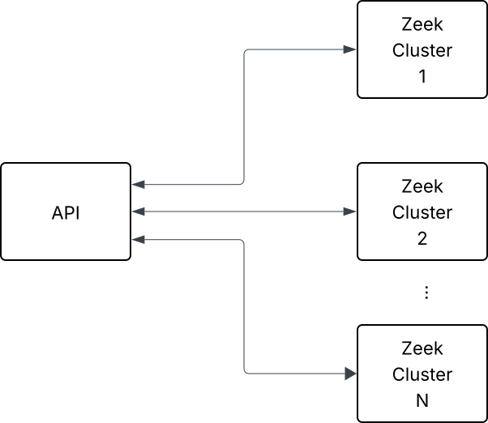
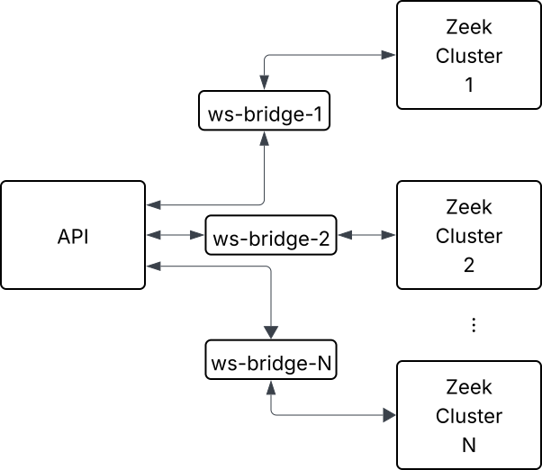

.. _websocat: https://github.com/vi/websocat

.. _websocket-api:

======================================
Interacting with Zeek using WebSockets
======================================

Introduction
============

Usually, Zeek produces protocol logs consumed by external applications. These
external applications might be SIEMs, real-time streaming analysis platforms
or basic archival processes compressing logs for long term storage.

Certain use-cases require interacting and influencing Zeek's runtime behavior
outside of static configuration via ``local.zeek``.

The classic :ref:`framework-input` and :ref:`framework-configuration` can be
leveraged for runtime configuration of Zeek as well as triggering arbitrary
events or script execution via option handlers. These frameworks are mostly
file- or process-based and may feel a bit unusual in environments where creation
of files is uncommon or even impossible due to separation of concerns. In many
of today's environments, interacting using HTTP-based APIs or other remote
interfaces is more common.

.. note::

    As an aside, if you need more flexibility than the WebSocket API offers today,
    an alternative could be to use :ref:`javascript` within Zeek. This opens the
    possibility to run a separate HTTP or a totally different Node.js based server
    within a Zeek process for quick experimentation and evaluation of other
    approaches.

Background and Setup
====================

Since Zeek 5.0, Zeek allows connections from external clients over WebSocket.
This allows these clients to interact with Zeek's publish-subscribe layer and
exchange Zeek events with other Zeek nodes.
Initially, this implementation resided in the Broker subsystem.
With Zeek 8.0, most of the implementation has been moved into core Zeek
itself with the v1 serialization format remaining in Broker.

WebSocket clients may subscribe to a fixed set of topics and will receive
Zeek events matching these topics that Zeek cluster nodes, but also other
WebSocket clients, publish.

With Zeek 8.0, Zeekctl has received support to interact with Zeek cluster nodes
using the WebSocket protocol. If you're running a Zeekctl based cluster and
want to experiment with WebSocket functionality, add ``UseWebSocket = 1`` to
your ``zeekctl.cfg``:

.. code-block:: ini

    # zeekctl.cfg
    ...
    UseWebSocket = 1

This will essentially add the following snippet, enabling a WebSocket server
on the Zeek manager:

.. code-block:: zeek
   :caption: websocket.zeek

   event zeek_init()
        {
        if ( Cluster::local_node_type() == Cluster::MANAGER )
            {
            Cluster::listen_websocket([
                $listen_addr=127.0.0.1,
                $listen_port=27759/tcp,
            ]);
            }
        }

To verify that the WebSocket API is functional in your deployment use, for example,
`websocat`_ as a quick check.

.. code-block:: shell

   $ echo '[]' | websocat ws://127.0.0.1:27759/v1/messages/json
   {"type":"ack","endpoint":"3eece35d-9f94-568d-861c-6a16c433e090-websocket-2","version":"8.0.0-dev.684"}

Zeek's ``cluster.log`` file will also have an entry for the WebSocket client connection.
The empty array in the command specifies the client's subscriptions, in this case none.

Version 1
=========

The currently implemented protocol is accessible at ``/v1/messages/json``.
The `data representation <https://docs.zeek.org/projects/broker/en/current/web-socket.html#data-representation>`_
is documented in detail within the Broker project. Note that this format is a
direct translation of Broker's binary format into JSON, resulting in a fairly
tight coupling between WebSocket clients and the corresponding Zeek scripts.
Most prominently is the representation of record values as vectors instead
of objects, making the protocol sensitive against reordering or introduction
of optional fields to records.

.. note::

   We're looking into an iteration of the format. If you have feedback or
   would like to contribute, please reach out on the usual community channels.

Handshake and Acknowledgement
-----------------------------

The first message after a WebSocket connection has been established originates
from the client. This message is a JSON array of strings that represent the
topics the WebSocket client wishes to subscribe to.

Zeek replies with an acknowledgement message that's a JSON object or an error.

Events
------

After the acknowledgement, WebSocket clients receive all events arriving on
topics they have subscribed to.

.. code-block:: shell

   $ websocat ws://127.0.0.1:27759/v1/messages/json
   ["zeek.test"]
   {"type":"ack","endpoint":"d955d990-ad8a-5ed4-8bc5-bee252d4a2e6-websocket-0","version":"8.0.0-dev.684"}
   {"type":"data-message","topic":"zeek.test","@data-type":"vector","data":[{"@data-type":"count","data":1},{"@data-type":"count","data":1},{"@data-type":"vector","data":[{"@data-type":"string","data":"hello"},{"@data-type":"vector","data":[{"@data-type":"count","data":3}]},{"@data-type":"vector","data":[]}]}]}

The received messages, again, are encoded in Broker's JSON format. Above ``data-message``
represents an event received on topic ``zeek.test``. The event's name is ``hello``.
This event has a single argument of type :zeek:type:`count`. In the example above
its value is ``3``.

To send events, WebSocket clients similarly encode their event representation
to Broker's JSON format and send them as `text data frames <https://datatracker.ietf.org/doc/html/rfc6455#section-5.6>`_.

X-Application-Name Header
-------------------------

When a WebSocket client includes an ``X-Application-Name`` HTTP header in
the initial WebSocket Handshake's GET request, that header's value is available
in the :zeek:see:`Cluster::websocket_client_added` event's ``endpoint`` argument (see :zeek:see:`Cluster::EndpointInfo`).

The header's value will also be included in ``cluster.log`` messages.

Additionally, if the cluster telemetry for WebSocket clients is set to
:zeek:see:`Cluster::Telemetry::VERBOSE` or :zeek:see:`Cluster::Telemetry::DEBUG`
via :zeek:see:`Cluster::Telemetry::websocket_metrics`, the header's value is
included as ``app`` label in metrics exposed by the :ref:`framework-telemetry`.

As of Zeek 8.0, a WebSocket client will be rejected if the header is set, but
its value doesn't match ``[-/_.=:*@a-zA-Z0-9]+``.

Language Bindings
-----------------

Note that it's possible to use any language that offers WebSocket bindings.
The ones listed below mostly add a bit of convenience features around the
initial Handshake message, error handling and serializing Zeek events and
values into the Broker-specific serialization format.

For example, using the Node.js `builtin WebSocket functionality <https://nodejs.org/en/learn/getting-started/websocket>`_,
the ``websocat`` example from above can be reproduced as follows:

.. code-block:: javascript
   :caption: client.js

   // client.js
   const socket = new WebSocket('ws://192.168.122.107:27759/v1/messages/json');

   socket.addEventListener('open', event => {
     socket.send('["zeek.test"]');
   });

   socket.addEventListener('message', event => {
     console.log('Message from server: ', event.data);
   });

.. code-block:: shell

   $ node ./client.js
   Message from server:  {"type":"ack","endpoint":"2e951b0c-3ca4-504c-ae8a-5d3750fec588-websocket-10","version":"8.0.0-dev.684"}
   Message from server:  {"type":"data-message","topic":"zeek.test","@data-type":"vector","data":[{"@data-type":"count","data":1},{"@data-type":"count","data":1},{"@data-type":"vector","data":[{"@data-type":"string","data":"hello"},{"@data-type":"vector","data":[{"@data-type":"count","data":374}]},{"@data-type":"vector","data":[]}]}]}

Golang
^^^^^^

* `Zeek Broker websocket interface library for Golang <https://github.com/corelight/go-zeek-broker-ws>`_ (not an official Zeek project)

Rust
^^^^

* `Rust types for interacting with Zeek over WebSocket <https://github.com/bbannier/zeek-websocket-rs>`_ (not an official Zeek project)

Python
^^^^^^

There are no ready to use Python libraries available, but the third-party
`websockets <https://github.com/python-websockets/websockets>`_ package
allows to get started quickly.
You may take inspiration from `zeek-client's implementation <https://github.com/zeek/zeek-client>`_
or the `small helper library <https://raw.githubusercontent.com/zeek/zeek/refs/heads/master/testing/btest/Files/ws/wstest.py>`_ used by various of Zeek's own tests for the
WebSocket API.
Zeekctl similarly ships a `light implementation <https://github.com/zeek/zeekctl/blob/93459b37c3deab4bec9e886211672024fa3e4759/ZeekControl/events.py#L159>`_
using the ``websockets`` library to implement its ``netstats`` and ``print`` commands.

Outgoing Connections
====================

For some deployment scenarios, Zeek only offering a WebSocket server can be cumbersome.
Concretely, when multiple independent Zeek clusters interact with
a single instance of a remote API. For instance, this could be needed for
configuring a central firewall.
In such scenarios, it is more natural for Zeek to connect out to the
remote API, rather than the remote API connecting to the Zeek cluster.

For these use-cases, the current suggestion is to run a WebSocket bridge between
a Zeek cluster and the remote API. One concrete tool that can be used
for this purpose is `websocat`_.

.. note::

   This topic has previously been discussed elsewhere. The following
   `GitHub issue <https://github.com/zeek/zeek/issues/3597>`_ and
   `discussion <https://github.com/zeek/zeek/discussions/4768>`_
   provide more background and details.

Example Architecture
--------------------

   Multiple Zeek instances and a single remote API

The following proposal decouples the components using a WebSocket
bridge for every Zeek cluster. This ensures that the depicted remote API
does not need knowledge about an arbitrary number of Zeek clusters.

   Multiple Zeek instances and a single remote API with WebSocket bridges.

Example Implementation
----------------------

Assuming the depicted remote API provides a WebSocket server as well,
it is possible to use ``websocat`` as the bridge directly.
The crux for the remote API is that upon a new WebSocket client connection,
the first message is the topic array that the remote API wishes to subscribe
to on a Zeek cluster.

Putting these pieces together, the following JavaScript script presents the
remote API, implemented using the `ws library <https://github.com/websockets/ws?tab=readme-ov-file>`_.
It accepts WebSocket clients on port 8080 and sends the topic array as the first message
containing just ``zeek.bridge.test``. Thereafter, it simply echos all incoming
WebSocket messages.

.. literalinclude:: websocket-api/server.js
   :caption: server.js
   :language: javascript

The Zeek side starts a WebSocket server on port 8000 and regularly publishes
a ``hello`` event to the ``zeek.bridge.test`` topic.

.. literalinclude:: websocket-api/server.zeek
   :caption: server.zeek
   :language: zeek

These two servers can now be connected by running ``websocat`` as follows:

.. code-block:: shell

    # In terminal 1 (use node if your Zeek has no JavaScript support)
    $ zeek server.js

    # In terminal 2
    $ zeek server.zeek

    # In terminal 3
    $ while true; do websocat --text -H='X-Application-Name: client1' ws://localhost:8000/v1/messages/json ws://localhost:8080 || sleep 0.1 ; done

The first few lines of output in terminal 1 should then look as follows:

.. code-block:: shell

   # zeek server.js
   client1: connected, sending topics array ["zeek.bridge.test"]
   client1: received: {"type":"ack","endpoint":"9089e06b-8d33-5585-ad79-4f7f6348754e-websocket-135","version":"8.1.0-dev.91"}
   client1: received: {"type":"data-message","topic":"zeek.bridge.test","@data-type":"vector","data":[{"@data-type":"count","data":1},{"@data-type":"count","data":1},{"@data-type":"vector","data":[{"@data-type":"string","data":"hello"},{"@data-type":"vector","data":[{"@data-type":"count","data":1792}]},{"@data-type":"vector","data":[]}]}]}
   ...

If you require synchronization between the Zeek instance and the remote API, this
is best achieved with events once the connection between the remote API and the
Zeek cluster is established.

Alternative Approaches
----------------------

Since v21, Node.js contains a built-in `WebSocket client <https://nodejs.org/en/learn/getting-started/websocket>`_,
making it possible to use vanilla :ref:`javascript` within
Zeek to establish outgoing WebSocket connections, too.

The ``websocat`` tool provides more flexibility, potentially allowing
to forward WebSocket messages to external commands which in turn could
use HTTP POST requests to an external API.
