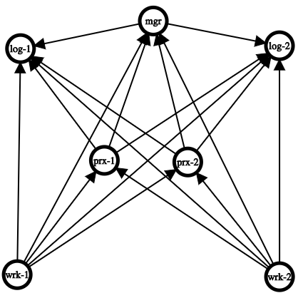

.. _CAF: https://github.com/actor-framework/actor-framework

.. _broker-framework:

==============================
Broker Communication Framework
==============================

.. rst-class:: opening

    Zeek uses the `Broker Library
    <https://docs.zeek.org/projects/broker>`_ to exchange information with
    other Zeek processes.  Broker itself uses CAF_ (C++ Actor Framework)
    internally for connecting nodes and exchanging arbitrary data over
    networks.  Broker then introduces, on top of CAF, a topic-based
    publish/subscribe communication pattern using a data model that is
    compatible to Zeek's.  Broker itself can be utilized outside the
    context of Zeek, with Zeek itself making use of only a few predefined
    Broker message formats that represent Zeek events, log entries, etc.

    In summary, the Zeek's Broker framework provides basic facilities for
    connecting broker-enabled peers (e.g. Zeek instances) to each other
    and exchanging messages (e.g. events and logs).

Cluster Layout / API
====================

Layout / Topology
-----------------

In a Zeek cluster setup, every Zeek process is assigned a cluster role.
Such a process is then called a Zeek node, a cluster node, or just named
after the role of the process (the manager, the loggers, ...). A basic Zeek
cluster uses four different node types, enumerated in the script-level
variable :zeek:see:`Cluster::NodeType`.

- Manager
- Logger
- Worker
- Proxy

In small Zeek deployments, all nodes may run on a single host. In large
Zeek deployments, nodes may be distributed across multiple physical
systems for scaling.

Currently, a single Manager node in a Zeek cluster exists. Further, connectivity
between nodes is determined statically based on their type:

- Every node connects to all loggers and the manager.

- Each worker connects to all proxies.

Some general suggestions as to the purpose/utilization of each node type:

- Workers: are a good first choice for doing the brunt of any work you need
  done.  They should be spending a lot of time performing the actual job
  of parsing/analyzing incoming data from packets, so you might choose
  to look at them as doing a "first pass" analysis and then deciding how
  the results should be shared with other nodes in the cluster.

- Proxies: serve as intermediaries for data storage and work/calculation
  offloading.  Good for helping offload work or data in a scalable and
  distributed way.  Since any given worker is connected to all
  proxies and can agree on an "arbitrary key -> proxy node" mapping
  (more on that later), you can partition work or data amongst them in a
  uniform manner.  e.g. you might choose to use proxies as a method of
  sharing non-persistent state or as a "second pass" analysis for any
  work that you don't want interfering with the workers' capacity to
  keep up with capturing and parsing packets.  Note that the default scripts
  that come with Zeek make minimal use of proxies, so if you are coming
  from a previous ZeekControl deployment, you may want to try reducing down
  to a single proxy node.  If you come to have custom/community scripts
  that utilize proxies, that would be the time to start considering scaling
  up the number of proxies to meet demands.

- Manager: this node will be good at performing decisions that require a
  global view of things since it is in a centralized location, connected
  to everything.  However, that also makes it easy to overload, so try
  to use it sparingly and only for tasks that must be done in a
  centralized or authoritative location. Optionally, for some
  deployments, the Manager can also serve as the sole Logger.

- Loggers: these nodes should simply be spending their time writing out
  logs to disk and not used for much else.  In the default cluster
  configuration, logs get distributed among available loggers in a
  round-robin fashion, providing failover capability should any given
  logger temporarily go offline.

Data Management/Sharing Strategies
==================================

There's maybe no single, best approach or pattern to use when you need a
Zeek script to store or share long-term state and data.  The two
approaches that were previously used were either using the ``&synchronized``
attribute on tables/sets or by explicitly sending events to specific
nodes on which you wanted data to be stored.  The former is no longer
possible, though there are several new possibilities that the new
Broker/Cluster framework offer, namely distributed data store and data
partitioning APIs.

Data Stores
-----------

Broker provides a distributed key-value store interface with optional
choice of using a persistent backend. For more detail, see
:ref:`this example <data_store_example>`.

Some ideas/considerations/scenarios when deciding whether to use
a data store for your use-case:

* If you need the full data set locally in order to achieve low-latency
  queries using data store "clones" can provide that.

* If you need data that persists across restarts of Zeek processes, then
  data stores can also provide that.

* If the data you want to store is complex (tables, sets, records) or
  you expect to read, modify, and store back, then data stores may not
  be able to provide simple, race-free methods of performing the pattern
  of logic that you want.

* If the data set you want to store is excessively large, that's still
  problematic even for stores that use a persistent backend as they are
  implemented in a way that requires a full snapshot of the store's
  contents to fit in memory (this limitation may change in the future).

Data Partitioning
-----------------

New data partitioning strategies are available using the API in
:doc:`/scripts/base/frameworks/cluster/pools.zeek`.  Using that API, developers
of custom Zeek scripts can define a custom pool of nodes that best fits the
needs of their script.

One example strategy is to use Highest Random Weight (HRW) hashing to
partition data tables amongst the pool of all proxy nodes.  e.g. using
:zeek:see:`Cluster::publish_hrw`.  This could allow clusters to
be scaled more easily than the approach of "the entire data set gets
synchronized to all nodes" as the solution to memory limitations becomes
"just add another proxy node".  It may also take away some of the
messaging load that used to be required to synchronize data sets across
all nodes.

The tradeoff of this approach, is that nodes that leave the pool (due to
crashing, etc.) cause a temporary gap in the total data set until
workers start hashing keys to a new proxy node that is still alive,
causing data to now be located and updated there.

If the developer of a script expects its workload to be particularly
intensive, wants to ensure that their operations get exclusive
access to nodes, or otherwise set constraints on the number of nodes within
a pool utilized by their script, then the :zeek:see:`Cluster::PoolSpec`
structure will allow them to do that while still allowing users of that script
to override the default suggestions made by the original developer.

Broker Framework Examples
=========================

The broker framework provides basic facilities for connecting Zeek instances
to each other and exchanging messages, like events or logs.

See :doc:`/scripts/base/frameworks/broker/main.zeek` for an overview
of the main Broker API.

.. _broker_topic_naming:

Topic Naming Conventions
------------------------

All Broker-based messaging involves two components: the information you
want to send (e.g. an event w/ its arguments) along with an associated
topic name string.  The topic strings are used as a filtering mechanism:
Broker uses a publish/subscribe communication pattern where peers
advertise interest in topic **prefixes** and only receive messages which
match one of their prefix subscriptions.

Broker itself supports arbitrary topic strings, however Zeek generally
follows certain conventions in choosing these topics to help avoid
conflicts and generally make them easier to remember.

As a reminder of how topic subscriptions work, subscribers advertise
interest in a topic **prefix** and then receive any messages published by a
peer to a topic name that starts with that prefix.  E.g. Alice
subscribes to the "alice/dogs" prefix, then would receive the following
message topics published by Bob:

- topic "alice/dogs/corgi"
- topic "alice/dogs"
- topic "alice/dogsarecool/oratleastilikethem"

Alice would **not** receive the following message topics published by Bob:

- topic "alice/cats/siamese"
- topic "alice/cats"
- topic "alice/dog"
- topic "alice"

Note that the topics aren't required to form a slash-delimited hierarchy,
the subscription matching is purely a byte-per-byte prefix comparison.

However, Zeek scripts generally will follow a topic naming hierarchy and
any given script will make the topic names it uses apparent via some
redef'able constant in its export section.  Generally topics that Zeek
scripts use will be along the lines of :samp:`zeek/{<namespace>}/{<specifics>}`
with :samp:`{<namespace>}` being the script's module name (in all-undercase).
For example, you might expect an imaginary ``Pretend`` framework to
publish/subscribe using topic names like ``zeek/pretend/my_cool_event``.
For scripts that use Broker as a means of cluster-aware analysis,
it's usually sufficient for them to make use of the topics declared
by the cluster framework.  For scripts that are meant to establish
communication flows unrelated to Zeek cluster, new topics are declared
(examples being the NetControl and Control frameworks).

For cluster operation, see :doc:`/scripts/base/frameworks/cluster/main.zeek`
for a list of topics that are useful for steering published events to
the various node classes.  E.g. you have the ability to broadcast
to all nodes of a given class (e.g. just workers) or just send to a
specific node within a class.

The topic names that logs get published under are a bit nuanced.  In the
default cluster configuration, they are round-robin published to
explicit topic names that identify a single logger.  In standalone Zeek
processes, logs get published to the topic indicated by
:zeek:see:`Broker::default_log_topic_prefix`.

For those writing their own scripts which need new topic names, a
suggestion would be to avoid prefixing any new topics/prefixes with
``zeek/`` as any changes in scripts shipping with Zeek will use that prefix
and it's better to not risk unintended conflicts.  Again, it's
often less confusing to just re-use existing topic names instead
of introducing new topic names.  The typical use case is writing
a cluster-enabled script, which usually just needs to route events
based upon node classes, and that already has usable topics in the
cluster framework.

Connecting to Peers
-------------------

Zeek can accept incoming connections by calling :zeek:see:`Broker::listen`.

.. literalinclude:: broker/connecting-listener.zeek
   :caption: connecting-listener.zeek
   :language: zeek
   :linenos:
   :tab-width: 4

Zeek can initiate outgoing connections by calling :zeek:see:`Broker::peer`.

.. literalinclude:: broker/connecting-connector.zeek
   :caption: connecting-connector.zeek
   :language: zeek
   :linenos:
   :tab-width: 4

In either case, connection status updates are monitored via the
:zeek:see:`Broker::peer_added` and :zeek:see:`Broker::peer_lost` events.

Remote Events
-------------

To receive remote events, you need to first subscribe to a "topic" to which
the events are being sent.  A topic is just a string chosen by the sender,
and named in a way that helps organize events into various categories.
See the :ref:`topic naming conventions section <broker_topic_naming>` for
more on how topics work and are chosen.

Use the :zeek:see:`Broker::subscribe` function to subscribe to topics and
define any event handlers for events that peers will send.

.. literalinclude:: broker/events-listener.zeek
   :caption: events-listener.zeek
   :language: zeek
   :linenos:
   :tab-width: 4

There are two different ways to send events.

The first is to call the :zeek:see:`Broker::publish` function which you can
supply directly with the event and its arguments or give it the return value of
:zeek:see:`Broker::make_event` in case you need to send the same event/args
multiple times.  When publishing events like this, local event handlers for
the event are not called.

The second option is to call the :zeek:see:`Broker::auto_publish` function where
you specify a particular event that will be automatically sent to peers
whenever the event is called locally via the normal event invocation syntax.
When auto-publishing events, local event handlers for the event are called
in addition to sending the event to any subscribed peers.

.. literalinclude:: broker/events-connector.zeek
   :caption: events-connector.zeek
   :language: zeek
   :linenos:
   :tab-width: 4

Note that the subscription model is prefix-based, meaning that if you subscribe
to the ``zeek/events`` topic prefix you would receive events that are published
to topic names ``zeek/events/foo`` and ``zeek/events/bar`` but not
``zeek/misc``.

Remote Logging
--------------

.. literalinclude:: broker/testlog.zeek
   :caption: testlog.zeek
   :language: zeek
   :linenos:
   :tab-width: 4

To toggle remote logs, redef :zeek:see:`Log::enable_remote_logging`.
Use the :zeek:see:`Broker::subscribe` function to advertise interest
in logs written by peers.  The topic names that Zeek uses are determined by
:zeek:see:`Broker::log_topic`.

.. literalinclude:: broker/logs-listener.zeek
   :caption: logs-listener.zeek
   :language: zeek
   :linenos:
   :tab-width: 4

.. literalinclude:: broker/logs-connector.zeek
   :caption: logs-connector.zeek
   :language: zeek
   :linenos:
   :tab-width: 4

Note that logging events are only raised locally on the node that performs
the :zeek:see:`Log::write` and not automatically published to peers.

.. _data_store_example:

Distributed Data Stores
-----------------------

See :doc:`/scripts/base/frameworks/broker/store.zeek` for an overview
of the Broker data store API.

There are two flavors of key-value data store interfaces: master and clone.

A master data store can be cloned from remote peers which may then
perform lightweight, local queries against the clone, which
automatically stays synchronized with the master store.  Clones cannot
modify their content directly, instead they send modifications to the
centralized master store which applies them and then broadcasts them to
all clones.

Master stores get to choose what type of storage backend to
use.  E.g. In-memory versus SQLite for persistence.

Data stores also support expiration on a per-key basis using an amount of
time relative to the entry's last modification time.

.. literalinclude:: broker/stores-listener.zeek
   :caption: stores-listener.zeek
   :language: zeek
   :linenos:
   :tab-width: 4

.. literalinclude:: broker/stores-connector.zeek
   :caption: stores-connector.zeek
   :language: zeek
   :linenos:
   :tab-width: 4

Note that all data store queries must be made within Zeek's asynchronous
``when`` statements and must specify a timeout block.

SQLite Data Store Tuning
^^^^^^^^^^^^^^^^^^^^^^^^

When leveraging the SQLite backend for persistence, SQLite's default journaling
and consistency settings are used. Concretely, ``journal_mode`` is set to
``DELETE`` and ``synchronous`` to ``FULL``. This in turn is not optimal for
`high INSERT or UPDATE rates <https://www.sqlite.org/faq.html#q19>`_
due to SQLite waiting for the required IO to complete until data is safely
on disk. This can also have a non-negligible system effect when the
SQLite database is located on the same device as other IO critical processes.

Starting with Zeek 5.2, it is possible to tune and relax these settings by
providing an appropriate :zeek:see:`Broker::BackendOptions` and
:zeek:see:`Broker::SQLiteOptions` instance to
:zeek:see:`Broker::create_master`. The following example changes the
data store to use `Write-Ahead Logging <https://www.sqlite.org/wal.html>`_
which should perform significantly faster than the default.

.. literalinclude:: broker/store-sqlite-tuning.zeek
   :caption: store-sqlite-tuning.zeek
   :language: zeek
   :linenos:
   :tab-width: 4

If your use-case turns out to require more and lower-level tuning around
SQLite options, please get in contact or open a feature request on GitHub.

Cluster Framework Examples
==========================

This section contains a few brief examples of how various communication
patterns one might use when developing Zeek scripts that are to operate in
the context of a cluster.

.. _event-namespacing-pitfall:

A Reminder About Events and Module Namespaces
---------------------------------------------

For simplicity, the following examples do not use any modules/namespaces.
If you choose to use them within your own code, it's important to
remember that the ``event`` and ``schedule`` dispatching statements
should always use the fully-qualified event name.

For example, this will likely not work as expected:

.. code-block:: zeek

    module MyModule;

    export {
        global my_event: event();
    }

    event my_event()
        {
        print "got my event";
        }

    event zeek_init()
        {
        event my_event();
        schedule 10sec { my_event() };
        }

This code runs without errors, however, the local ``my_event`` handler
will never be called and also not any remote handlers either, even if
:zeek:see:`Broker::auto_publish` was used elsewhere for it.  Instead, at
minimum you would need change the ``zeek_init()`` handler:

.. code-block:: zeek

    event zeek_init()
        {
        event MyModule::my_event();
        schedule 10sec { MyModule::my_event() };
        }

Though, an easy rule of thumb to remember would be to always use the
explicit module namespace scoping and you can't go wrong:

.. code-block:: zeek

    module MyModule;

    export {
        global MyModule::my_event: event();
    }

    event MyModule::my_event()
        {
        print "got my event";
        }

    event zeek_init()
        {
        event MyModule::my_event();
        schedule 10sec { MyModule::my_event() };
        }

Event types that reside in the default namespace (such as :zeek:id:`zeek_init` or
:zeek:id:`connection_established`) require no qualification, even when scheduled from
inside a module. Don't force qualification of such events by prefixing with
``GLOBAL::``.

Note that other identifiers in Zeek do not have this inconsistency
related to module namespacing, it's just events that require
explicitness.

Manager Sending Events To Workers
---------------------------------

This is fairly straightforward, we just need a topic name which we know
all workers are subscribed combined with the event we want to send them.

.. code-block:: zeek

    event manager_to_workers(s: string)
        {
        print "got event from manager", s;
        }

    event some_event_handled_on_manager()
        {
        Broker::publish(Cluster::worker_topic, manager_to_workers,
                        "hello v0");

        # If you know this event is only handled on the manager, you don't
        # need any of the following conditions, they're just here as an
        # example of how you can further discriminate based on node identity.

        # Can check based on the name of the node.
        if ( Cluster::node == "manager" )
            Broker::publish(Cluster::worker_topic, manager_to_workers,
                            "hello v1");

        # Can check based on the type of the node.
        if ( Cluster::local_node_type() == Cluster::MANAGER )
            Broker::publish(Cluster::worker_topic, manager_to_workers,
                            "hello v2");

        # The run-time overhead of the above conditions can even be
        # eliminated by using the following conditional directives.
        # It's evaluated once per node at parse-time and, if false,
        # any code within is just ignored / treated as not existing at all.
    @if ( Cluster::local_node_type() == Cluster::MANAGER )
            Broker::publish(Cluster::worker_topic, manager_to_workers,
                            "hello v3");
    @endif
        }

Worker Sending Events To Manager
--------------------------------

This should look almost identical to the previous case of sending an event
from the manager to workers, except it simply changes the topic name to
one which the manager is subscribed.

.. code-block:: zeek

    event worker_to_manager(worker_name: string)
        {
        print "got event from worker", worker_name;
        }

    event some_event_handled_on_worker()
        {
        Broker::publish(Cluster::manager_topic, worker_to_manager,
                        Cluster::node);
        }

Worker Sending Events To All Workers
------------------------------------

Since workers are not directly connected to each other in the cluster
topology, this type of communication is a bit different than what we
did before since we have to manually relay the event via some node that *is*
connected to all workers.  The manager or a proxy satisfies that requirement:

.. code-block:: zeek

    event worker_to_workers(worker_name: string)
        {
    @if ( Cluster::local_node_type() == Cluster::MANAGER ||
          Cluster::local_node_type() == Cluster::PROXY )
            Broker::publish(Cluster::worker_topic, worker_to_workers,
                            worker_name);
    @else
            print "got event from worker", worker_name;
    @endif
        }

    event some_event_handled_on_worker()
        {
        # We know the manager is connected to all workers, so we could
        # choose to relay the event across it.
        Broker::publish(Cluster::manager_topic,  worker_to_workers,
                        Cluster::node + " (via manager)");

        # We also know that any given proxy is connected to all workers,
        # though now we have a choice of which proxy to use.  If we
        # want to distribute the work associated with relaying uniformly,
        # we can use a round-robin strategy.  The key used here is simply
        # used by the cluster framework internally to keep track of
        # which node is up next in the round-robin.
        local pt = Cluster::rr_topic(Cluster::proxy_pool, "example_key");
        Broker::publish(pt, worker_to_workers,
                        Cluster::node + " (via a proxy)");
        }

Worker Distributing Events Uniformly Across Proxies
---------------------------------------------------

If you want to offload some data/work from a worker to your proxies,
we can make use of a `Highest Random Weight (HRW) hashing
<https://en.wikipedia.org/wiki/Rendezvous_hashing>`_ distribution strategy
to uniformly map an arbitrary key space across all available proxies.

.. code-block:: zeek

    event worker_to_proxies(worker_name: string)
        {
        print "got event from worker", worker_name;
        }

    global my_counter = 0;

    event some_event_handled_on_worker()
        {
        # The key here is used to choose which proxy shall receive
        # the event.  Different keys may map to different nodes, but
        # any given key always maps to the same node provided the
        # pool of nodes remains consistent.  If a proxy goes offline,
        # that key maps to a different node until the original comes
        # back up.
        Cluster::publish_hrw(Cluster::proxy_pool,
                             cat("example_key", ++my_counter),
                             worker_to_proxies, Cluster::node);
        }

Broker-backed Zeek Tables for Data Synchronization and Persistence
==================================================================

Starting with Zeek 3.2, it is possible to "bind" a Zeek table to a backing
Broker store. Changes to the Zeek table are sent to the Broker store. Similarly,
changes of the Broker store are applied to the Zeek table.

This feature allows easy distribution of table contents across a cluster.
It also offers persistence for tables (when using a persistent Broker store
backend like SQLite).

To give a short example, to distribute a table over a cluster you can use
the :zeek:attr:`&backend` attribute.

.. code-block:: zeek

    global t: table[string] of count &backend=Broker::MEMORY;

The :zeek:attr:`&backend` attribute creates a master data store on the
manager and a clone data store on all other node on the cluster. This
in essence means that the table exists twice in each Zeek process. One
copy of the table is contained in a Broker data store (either a master
or a clone depending on the node), which data store distributes the
data across the cluster---and, depending on the backend, might also
make the data persistent. Since Broker data stores are only accessible
via asynchronous operations, and accessing them might not always be
immediate, a second copy of the table, which is immediately
accessible, is held inside the Zeek core. This is the copy that you
see and interact with on the Zeek side.
