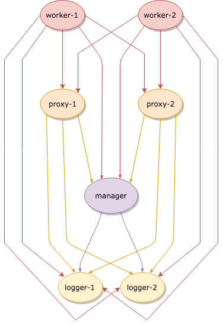

.. _brokercomm-framework:

==============================================
Broker-Enabled Communication/Cluster Framework
==============================================

.. rst-class:: opening

    Bro now uses the `Broker Library
    <../components/broker/README.html>`_ to exchange information with
    other Bro processes.  With this comes changes in how clusters
    operate and, since Broker significantly differs from the previous
    communication framework, there are several changes in the set of
    scripts that Bro ships with that may break your own customizations.
    This document aims to describe the changes that have been made,
    making it easier to port your own scripts, as well as go over the
    features of Broker and the new cluster framework that are now
    available to use in new Bro scripts and customizations.

.. contents::

Porting Guide / Notable Script API Changes
==========================================

Review and use the points below as a guide to port your own scripts
to the latest version of Bro, which uses the new cluster and Broker
communication framework.

- ``@load policy/frameworks/communication/listen`` and
  ``@load base/frameworks/communication`` indicates use of the
  old communication framework, consider porting to
  ``@load base/frameworks/broker`` and using the Broker API:
  :doc:`/scripts/base/frameworks/broker/main.bro`

- The ``&synchronized`` attribute should no longer be used.

- :bro:see:`Software::tracked` is now partitioned among proxy nodes
  instead of synchronized in its entirety to all nodes.

- ``Known::known_devices`` is renamed to :bro:see:`Known::device_store`
  and implemented via the new Broker data store interface.
  Also use :bro:see:`Known::device_found` instead of updating the
  store directly directly.

- ``Known::known_hosts`` is renamed to :bro:see:`Known::host_store` and
  implemented via the new Broker data store interface.

- ``Known::known_services`` is renamed to :bro:see:`Known::service_store`
  and implemented via the new Broker data store interface.

- ``Known::certs`` is renamed to :bro:see:`Known::cert_store`
  and implemented via the new Broker data store interface.

- Instead of using e.g. ``Cluster::manager2worker_events`` (and all
  permutations for every node type), what you'd now use is either 
  :bro:see:`Broker::publish` or :bro:see:`Broker::auto_publish` with
  either the topic associated with a specific node or class of nodes,
  like :bro:see:`Cluster::node_topic` or
  :bro:see:`Cluster::worker_topic`.

New Cluster Layout/API
======================

Layout / Topology
-----------------

The cluster topology has changed.

- Proxy nodes no longer connect with each other.

- Each worker node connects to all proxies.

- All node types connect to all logger nodes and the manager node.

This looks like:

Data Management Strategies
==========================

There's maybe no single, best approach or pattern to use when you need a
Bro script to store long-term state and data.  The two approaches that
were previously used were either using ``&synchronized`` attribute on
tables/sets or by explicitly sending events to specific nodes on which
you wanted data to be stored.  The former is no longer possible, though
there are several new possibilities that the new Broker/Cluster
framework offer, namely distributed data store and data partitioning
APIs.

Data Stores
-----------

Broker provides a distributed key-value store interface with optional
choice of suing a persistent backend. For more detail, see
:ref:`this example <data_store_example>`.

Some ideas/considerations/scenarios when deciding whether to use
a data store for your use-case:

* If you need the full data set locally in order to achieve low-latency
  queries using data store "clones" can provide that.

* If you need data that persists across restarts of Bro processes, then
  data stores can also provide that.

* If the data you want to store is complex (tables, sets, records) or
  you expect to read, modify, and store back, then data stores may not
  be able to provide simple, race-free methods of performing the pattern
  of logic that you want.

Data Partitioning
-----------------

New data partitioning strategies are available using the API in
:doc:`/scripts/base/frameworks/cluster/pools.bro`.

One example strategy is to use Highest Random Weight (HRW) hashing to
partition data tables amongst proxy nodes.  e.g. using
:bro:see:`Cluster::publish_hrw`.  This could allow clusters to
be scaled more easily than the approach of "the entire data set gets
synchronized to all nodes" as the solution to memory limitations becomes
"just add another proxy node".  It may also take away some of the
messaging load that used to be required to synchronize data sets across
all nodes.

The tradeoff of this approach, is that nodes that leave the pool (due to
crashing, etc.) cause a temporary gap in the total data set until
workers start hashing keys to a new proxy node that is still alive,
causing data to now be located and updated there.

New Broker Framework
====================

The broker framework provides basic facilities for connecting Bro instances
to eachother and exchanging messages, like events or logs.

See :doc:`/scripts/base/frameworks/broker/main.bro` for an overview
of the main Broker API.

Connecting to Peers
-------------------

Bro can accept incoming connections by calling :bro:see:`Broker::listen`.

.. btest-include:: ${DOC_ROOT}/frameworks/broker/connecting-listener.bro

Bro can initiate outgoing connections by calling :bro:see:`Broker::peer`.

.. btest-include:: ${DOC_ROOT}/frameworks/broker/connecting-connector.bro

In either case, connection status updates are monitored via the
:bro:see:`Broker::peer_added` and :bro:see:`Broker::peer_lost` events.

Remote Events
-------------

To receive remote events, you need to first subscribe to a "topic" to which
the events are being sent.  A topic is just a string chosen by the sender,
and named in a way that helps organize events into various categories.  Use
the :bro:see:`Broker::subscribe` function to subscribe to topics and define
any event handlers for events that peers will send.

.. btest-include:: ${DOC_ROOT}/frameworks/broker/events-listener.bro

There are two different ways to send events.

The first is to call the :bro:see:`Broker::publish` function which you can
supply directly with the event and its arguments or give it the return value of
:bro:see:`Broker::make_event` in case you need to send the same event/args
multiple times.  When publishing events like this, local event handlers for
the event are not called.

The second option is to call the :bro:see:`Broker::auto_publish` function where
you specify a particular event that will be automatically sent to peers
whenever the event is called locally via the normal event invocation syntax.
When auto-publishing events, local event handler for the event are called
in addition to sending the event to any subscribed peers.

.. btest-include:: ${DOC_ROOT}/frameworks/broker/events-connector.bro

Note that the subscription model is prefix-based, meaning that if you subscribe
to the "bro/events" topic prefix you would receive events that are published
to topic names  "bro/events/foo" and "bro/events/bar" but not "bro/misc".

Remote Logging
--------------

.. btest-include:: ${DOC_ROOT}/frameworks/broker/testlog.bro

To toggle remote logs, redef :bro:see:`Log::enable_remote_logging`.
Use the :bro:see:`Broker::subscribe` function to advertise interest
in logs written by peers.  The topic names that Bro uses are determined by
:bro:see:`Broker::log_topic`.

.. btest-include:: ${DOC_ROOT}/frameworks/broker/logs-listener.bro

.. btest-include:: ${DOC_ROOT}/frameworks/broker/logs-connector.bro

Note that logging events are only raised locally on the node that performs
the :bro:see:`Log::write` and not automatically published to peers.

.. _data_store_example:

Distributed Data Stores
-----------------------

See :doc:`/scripts/base/frameworks/broker/store.bro` for an overview
of the Broker data store API.

There are two flavors of key-value data store interfaces: master and clone.

A master data store can be cloned from remote peers which may then
perform lightweight, local queries against the clone, which
automatically stays synchronized with the master store.  Clones cannot
modify their content directly, instead they send modifications to the
centralized master store which applies them and then broadcasts them to
all clones.

Master stores get to choose what type of storage backend to
use.  E.g. In-memory versus SQLite for persistence.

Data stores also support expiration on a per-key basis using an amount of
time relative to the entry's last modification time.

.. btest-include:: ${DOC_ROOT}/frameworks/broker/stores-listener.bro

.. btest-include:: ${DOC_ROOT}/frameworks/broker/stores-connector.bro

Note that all data store queries must be made within Bro's asynchronous
``when`` statements and must specify a timeout block.
