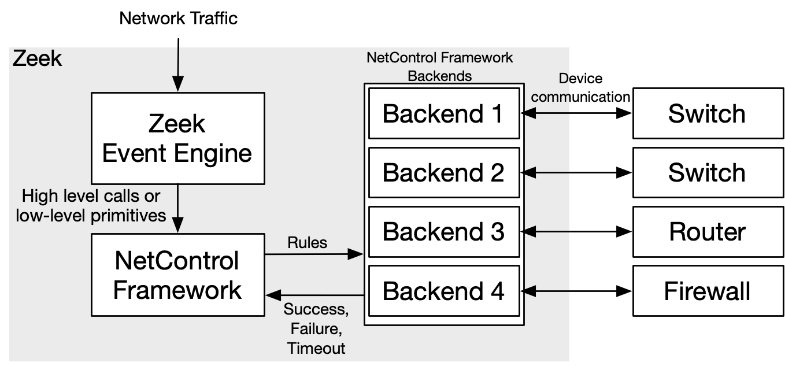
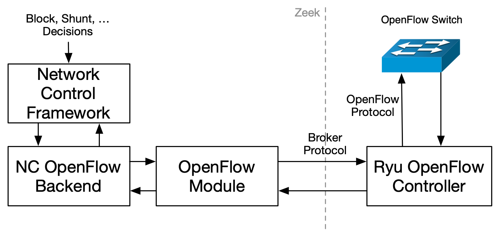

.. _framework-netcontrol:

====================
NetControl Framework
====================

.. TODO: integrate BoZ revisions

.. rst-class:: opening

  Zeek can connect with network devices like, for example, switches
  or soft- and hardware firewalls using the NetControl framework. The
  NetControl framework provides a flexible, unified interface for active
  response and hides the complexity of heterogeneous network equipment
  behind a simple task-oriented API, which is easily usable via Zeek
  scripts. This document gives an overview of how to use the NetControl
  framework in different scenarios; to get a better understanding of how
  it can be used in practice, it might be worthwhile to take a look at
  the integration tests.

NetControl Architecture
=======================

    NetControl architecture (click to enlarge).

The basic architecture of the NetControl framework is shown in the figure above.
Conceptually, the NetControl framework sits between the user provided scripts
(which use the Zeek event engine) and the network device (which can either be a
hardware or software device), that is used to implement the commands.

The NetControl framework supports a number of high-level calls, like the
:zeek:see:`NetControl::drop_address` function, or a lower level rule
syntax. After a rule has been added to the NetControl framework, NetControl
sends the rule to one or several of its *backends*. Each backend is responsible
to communicate with a single hard- or software device. The NetControl framework
tracks rules throughout their entire lifecycle and reports the status (like
success, failure and timeouts) back to the user scripts.

The backends are implemented as Zeek scripts using a plugin based API; an example
for this is :doc:`/scripts/base/frameworks/netcontrol/plugins/broker.zeek`. This
document will show how to write plugins in
:ref:`framework-netcontrol-plugins`.

NetControl API
==============

High-level NetControl API
-------------------------

In this section, we will introduce the high level NetControl API. As mentioned
above, NetControl uses *backends* to communicate with the external devices that
will implement the rules. You will need at least one active backend before you
can use NetControl. For our examples, we will just use the debug plugin to
create a backend. This plugin outputs all actions that are taken to the standard
output.

Backends should be initialized in the :zeek:see:`NetControl::init` event, calling
the :zeek:see:`NetControl::activate` function after the plugin instance has been
initialized. The debug plugin can be initialized as follows:

.. code-block:: zeek

  event NetControl::init()
    {
    local debug_plugin = NetControl::create_debug(T);
    NetControl::activate(debug_plugin, 0);
    }

After at least one backend has been added to the NetControl framework, the
framework can be used and will send added rules to the added backend.

The NetControl framework contains several high level functions that allow users
to drop connections of certain addresses and networks, shunt network traffic,
etc. The following table shows and describes all of the currently available
high-level functions.

.. list-table::
    :widths: 32 40
    :header-rows: 1

    * - Function
      - Description

    * - :zeek:see:`NetControl::drop_address`
      - Calling this function causes NetControl to block all packets involving
        an IP address from being forwarded.

    * - :zeek:see:`NetControl::drop_connection`
      - Calling this function stops all packets of a specific connection
        (identified by its 5-tuple) from being forwarded.

    * - :zeek:see:`NetControl::drop_address_catch_release`
      - Calling this function causes all packets of a specific source IP to be
        blocked. This function uses catch-and-release functionality and the IP
        address is only dropped for a short amount of time to conserve rule
        space in the network hardware. It is immediately re-dropped when it is
        seen again in traffic. See :ref:`framework-netcontrol-catchrelease` for
        more information.

    * - :zeek:see:`NetControl::shunt_flow`
      - Calling this function causes NetControl to stop forwarding a
        uni-directional flow of packets to Zeek. This allows Zeek to conserve
        resources by shunting flows that have been identified as being benign.

    * - :zeek:see:`NetControl::redirect_flow`
      - Calling this function causes NetControl to redirect a uni-directional
        flow to another port of the networking hardware.

    * - :zeek:see:`NetControl::quarantine_host`
      - Calling this function allows Zeek to quarantine a host by sending DNS
        traffic to a host with a special DNS server, which resolves all queries
        as pointing to itself. The quarantined host is only allowed between the
        special server, which will serve a warning message detailing the next
        steps for the user.

    * - :zeek:see:`NetControl::whitelist_address`
      - Calling this function causes NetControl to push a whitelist entry for an
        IP address to the networking hardware.

    * - :zeek:see:`NetControl::whitelist_subnet`
      - Calling this function causes NetControl to push a whitelist entry for a
        subnet to the networking hardware.

After adding a backend, all of these functions can immediately be used and will
start sending the rules to the added backend(s). To give a very simple example,
the following script will simply block the traffic of all connections that it
sees being established:

.. literalinclude:: netcontrol-1-drop-with-debug.zeek
   :caption:
   :language: zeek
   :linenos:
   :tab-width: 4

Running this script on a file containing one connection will cause the debug
plugin to print one line to the standard output, which contains information
about the rule that was added. It will also cause creation of `netcontrol.log`,
which contains information about all actions that are taken by NetControl:

.. code-block:: console

   $ zeek -C -r tls/ecdhe.pcap netcontrol-1-drop-with-debug.zeek
   netcontrol debug (Debug-All): init
   netcontrol debug (Debug-All): add_rule: [ty=NetControl::DROP, target=NetControl::FORWARD, entity=[ty=NetControl::CONNECTION, conn=[orig_h=192.168.18.50, orig_p=56981/tcp, resp_h=74.125.239.97, resp_p=443/tcp], flow=<uninitialized>, ip=<uninitialized>, mac=<uninitialized>], expire=20.0 secs, priority=0, location=, out_port=<uninitialized>, mod=<uninitialized>, id=2, cid=2, _plugin_ids={\x0a\x0a}, _active_plugin_ids={\x0a\x0a}, _no_expire_plugins={\x0a\x0a}, _added=F]

   $ cat netcontrol.log
   #separator \x09
   #set_separator    ,
   #empty_field      (empty)
   #unset_field      -
   #path     netcontrol
   #open     2018-12-14-18-50-53
   #fields   ts      rule_id category        cmd     state   action  target  entity_type     entity  mod     msg     priority        expire  location        plugin
   #types    time    string  enum    string  enum    string  enum    string  string  string  string  int     interval        string  string
   0.000000  -       NetControl::MESSAGE     -       -       -       -       -       -       -       activating plugin with priority 0       -       -       -       Debug-All
   0.000000  -       NetControl::MESSAGE     -       -       -       -       -       -       -       activation finished     -       -       -       Debug-All
   0.000000  -       NetControl::MESSAGE     -       -       -       -       -       -       -       plugin initialization done      -       -       -       -
   1398529018.678276 2       NetControl::RULE        ADD     NetControl::REQUESTED   NetControl::DROP        NetControl::FORWARD     NetControl::CONNECTION  192.168.18.50/56981<->74.125.239.97/443 -       -       0       20.000000       -       Debug-All
   1398529018.678276 2       NetControl::RULE        ADD     NetControl::SUCCEEDED   NetControl::DROP        NetControl::FORWARD     NetControl::CONNECTION  192.168.18.50/56981<->74.125.239.97/443 -       -       0       20.000000       -       Debug-All
   #close    2018-12-14-18-50-53

In our case, `netcontrol.log` contains several :zeek:see:`NetControl::MESSAGE`
entries, which show that the debug plugin has been initialized and added.
Afterwards, there are two :zeek:see:`NetControl::RULE` entries; the first shows
that the addition of a rule has been requested (state is
:zeek:see:`NetControl::REQUESTED`). The following line shows that the rule was
successfully added (the state is :zeek:see:`NetControl::SUCCEEDED`). The
remainder of the log line gives more information about the added rule, which in
our case applies to a specific 5-tuple.

In addition to the netcontrol.log, the drop commands also create a second,
additional log called `netcontrol_drop.log`. This log file is much more succinct and
only contains information that is specific to drops that are enacted by
NetControl:

.. code-block:: console

   $ cat netcontrol_drop.log
   #separator \x09
   #set_separator    ,
   #empty_field      (empty)
   #unset_field      -
   #path     netcontrol_drop
   #open     2018-12-14-18-50-53
   #fields   ts      rule_id orig_h  orig_p  resp_h  resp_p  expire  location
   #types    time    string  addr    port    addr    port    interval        string
   1398529018.678276 2       192.168.18.50   56981   74.125.239.97   443     20.000000       -
   #close    2018-12-14-18-50-53

While this example of blocking all connections is usually not very useful, the
high-level API gives an easy way to take action, for example when a host is
identified doing some harmful activity. To give a more realistic example, the
following code automatically blocks a recognized SSH guesser:

.. literalinclude:: netcontrol-2-ssh-guesser.zeek
   :caption:
   :language: zeek
   :linenos:
   :tab-width: 4

.. code-block:: console

   $ zeek -C -r ssh/sshguess.pcap netcontrol-2-ssh-guesser.zeek
   netcontrol debug (Debug-All): init
   netcontrol debug (Debug-All): add_rule: [ty=NetControl::DROP, target=NetControl::FORWARD, entity=[ty=NetControl::ADDRESS, conn=<uninitialized>, flow=<uninitialized>, ip=192.168.56.1/32, mac=<uninitialized>], expire=1.0 hr, priority=0, location=, out_port=<uninitialized>, mod=<uninitialized>, id=2, cid=2, _plugin_ids={\x0a\x0a}, _active_plugin_ids={\x0a\x0a}, _no_expire_plugins={\x0a\x0a}, _added=F]

   $ cat netcontrol.log
   #separator \x09
   #set_separator    ,
   #empty_field      (empty)
   #unset_field      -
   #path     netcontrol
   #open     2018-12-14-18-50-54
   #fields   ts      rule_id category        cmd     state   action  target  entity_type     entity  mod     msg     priority        expire  location        plugin
   #types    time    string  enum    string  enum    string  enum    string  string  string  string  int     interval        string  string
   0.000000  -       NetControl::MESSAGE     -       -       -       -       -       -       -       activating plugin with priority 0       -       -       -       Debug-All
   0.000000  -       NetControl::MESSAGE     -       -       -       -       -       -       -       activation finished     -       -       -       Debug-All
   0.000000  -       NetControl::MESSAGE     -       -       -       -       -       -       -       plugin initialization done      -       -       -       -
   1427726759.303199 2       NetControl::RULE        ADD     NetControl::REQUESTED   NetControl::DROP        NetControl::FORWARD     NetControl::ADDRESS     192.168.56.1/32 -       -       0       3600.000000     -       Debug-All
   1427726759.303199 2       NetControl::RULE        ADD     NetControl::SUCCEEDED   NetControl::DROP        NetControl::FORWARD     NetControl::ADDRESS     192.168.56.1/32 -       -       0       3600.000000     -       Debug-All
   #close    2018-12-14-18-50-54

Note that in this case, instead of calling NetControl directly, we also can use
the :zeek:see:`Notice::ACTION_DROP` action of the notice framework:

.. literalinclude:: netcontrol-3-ssh-guesser.zeek
   :caption:
   :language: zeek
   :linenos:
   :tab-width: 4

.. code-block:: console

   $ zeek -C -r ssh/sshguess.pcap netcontrol-3-ssh-guesser.zeek
   netcontrol debug (Debug-All): init
   netcontrol debug (Debug-All): add_rule: [ty=NetControl::DROP, target=NetControl::FORWARD, entity=[ty=NetControl::ADDRESS, conn=<uninitialized>, flow=<uninitialized>, ip=192.168.56.1/32, mac=<uninitialized>], expire=10.0 mins, priority=0, location=ACTION_DROP: T, out_port=<uninitialized>, mod=<uninitialized>, id=2, cid=2, _plugin_ids={\x0a\x0a}, _active_plugin_ids={\x0a\x0a}, _no_expire_plugins={\x0a\x0a}, _added=F]

   $ cat netcontrol.log
   #separator \x09
   #set_separator    ,
   #empty_field      (empty)
   #unset_field      -
   #path     netcontrol
   #open     2018-12-14-18-50-55
   #fields   ts      rule_id category        cmd     state   action  target  entity_type     entity  mod     msg     priority        expire  location        plugin
   #types    time    string  enum    string  enum    string  enum    string  string  string  string  int     interval        string  string
   0.000000  -       NetControl::MESSAGE     -       -       -       -       -       -       -       activating plugin with priority 0       -       -       -       Debug-All
   0.000000  -       NetControl::MESSAGE     -       -       -       -       -       -       -       activation finished     -       -       -       Debug-All
   0.000000  -       NetControl::MESSAGE     -       -       -       -       -       -       -       plugin initialization done      -       -       -       -
   1427726759.303199 2       NetControl::RULE        ADD     NetControl::REQUESTED   NetControl::DROP        NetControl::FORWARD     NetControl::ADDRESS     192.168.56.1/32 -       -       0       600.000000      ACTION_DROP: T  Debug-All
   1427726759.303199 2       NetControl::RULE        ADD     NetControl::SUCCEEDED   NetControl::DROP        NetControl::FORWARD     NetControl::ADDRESS     192.168.56.1/32 -       -       0       600.000000      ACTION_DROP: T  Debug-All
   #close    2018-12-14-18-50-55

Using the :zeek:see:`Notice::ACTION_DROP` action of the notice framework also
will cause the `dropped` column in `notice.log` to be set to true each time that
the NetControl framework enacts a block:

.. code-block:: console

   $ cat notice.log
   #separator \x09
   #set_separator    ,
   #empty_field      (empty)
   #unset_field      -
   #path     notice
   #open     2018-12-14-18-50-55
   #fields   ts      uid     id.orig_h       id.orig_p       id.resp_h       id.resp_p       fuid    file_mime_type  file_desc       proto   note    msg     sub     src     dst     p       n       peer_descr      actions suppress_for    dropped remote_location.country_code    remote_location.region  remote_location.city    remote_location.latitude        remote_location.longitude
   #types    time    string  addr    port    addr    port    string  string  string  enum    enum    string  string  addr    addr    port    count   string  set[enum]       interval        bool    string  string  string  double  double
   1427726759.303199 -       -       -       -       -       -       -       -       -       SSH::Password_Guessing  192.168.56.1 appears to be guessing SSH passwords (seen in 10 connections).     Sampled servers:  192.168.56.103, 192.168.56.103, 192.168.56.103, 192.168.56.103, 192.168.56.103        192.168.56.1    -       -       -       -       Notice::ACTION_DROP,Notice::ACTION_LOG  3600.000000     F       -       -       -       -       -
   #close    2018-12-14-18-50-55

Rule API
--------

As already mentioned in the last section, in addition to the high-level API, the
NetControl framework also supports a Rule based API which allows greater
flexibility while adding rules. Actually, all the high-level functions are
implemented using this lower-level rule API; the high-level functions simply
convert their arguments into the lower-level rules and then add the rules
directly to the NetControl framework (by calling :zeek:see:`NetControl::add_rule`).

The following figure shows the main components of NetControl rules:

    NetControl Rule overview (click to enlarge).

The types that are used to make up a rule are defined in
:doc:`/scripts/base/frameworks/netcontrol/types.zeek`.

Rules are defined as a :zeek:see:`NetControl::Rule` record. Rules have a *type*,
which specifies what kind of action is taken. The possible actions are to
**drop** packets, to **modify** them, to **redirect** or to **whitelist** them.
The *target* of a rule specifies if the rule is applied in the *forward path*,
and affects packets as they are forwarded through the network, or if it affects
the *monitor path* and only affects the packets that are sent to Zeek, but not
the packets that traverse the network. The *entity* specifies the address,
connection, etc. that the rule applies to. In addition, each rule has a
*timeout* (which can be left empty), a *priority* (with higher priority rules
overriding lower priority rules). Furthermore, a *location* string with more
text information about each rule can be provided.

There are a couple more fields that are only needed for some rule types. For
example, when you insert a redirect rule, you have to specify the port that
packets should be redirected to. All these fields are shown in the
:zeek:see:`NetControl::Rule` documentation.

To give an example on how to construct your own rule, we are going to write
our own version of the :zeek:see:`NetControl::drop_connection` function. The only
difference between our function and the one provided by NetControl is the fact
that the NetControl function has additional functionality, e.g. for logging.

Once again, we are going to test our function with a simple example that simply
drops all connections on the network:

.. literalinclude:: netcontrol-4-drop.zeek
   :caption:
   :language: zeek
   :linenos:
   :tab-width: 4

.. code-block:: console

   $ zeek -C -r tls/ecdhe.pcap netcontrol-4-drop.zeek
   netcontrol debug (Debug-All): init
   netcontrol debug (Debug-All): add_rule: [ty=NetControl::DROP, target=NetControl::FORWARD, entity=[ty=NetControl::CONNECTION, conn=[orig_h=192.168.18.50, orig_p=56981/tcp, resp_h=74.125.239.97, resp_p=443/tcp], flow=<uninitialized>, ip=<uninitialized>, mac=<uninitialized>], expire=20.0 secs, priority=0, location=<uninitialized>, out_port=<uninitialized>, mod=<uninitialized>, id=2, cid=2, _plugin_ids={\x0a\x0a}, _active_plugin_ids={\x0a\x0a}, _no_expire_plugins={\x0a\x0a}, _added=F]

   $ cat netcontrol.log
   #separator \x09
   #set_separator    ,
   #empty_field      (empty)
   #unset_field      -
   #path     netcontrol
   #open     2018-12-14-18-50-55
   #fields   ts      rule_id category        cmd     state   action  target  entity_type     entity  mod     msg     priority        expire  location        plugin
   #types    time    string  enum    string  enum    string  enum    string  string  string  string  int     interval        string  string
   0.000000  -       NetControl::MESSAGE     -       -       -       -       -       -       -       activating plugin with priority 0       -       -       -       Debug-All
   0.000000  -       NetControl::MESSAGE     -       -       -       -       -       -       -       activation finished     -       -       -       Debug-All
   0.000000  -       NetControl::MESSAGE     -       -       -       -       -       -       -       plugin initialization done      -       -       -       -
   1398529018.678276 2       NetControl::RULE        ADD     NetControl::REQUESTED   NetControl::DROP        NetControl::FORWARD     NetControl::CONNECTION  192.168.18.50/56981<->74.125.239.97/443 -       -       0       20.000000       -       Debug-All
   1398529018.678276 2       NetControl::RULE        ADD     NetControl::SUCCEEDED   NetControl::DROP        NetControl::FORWARD     NetControl::CONNECTION  192.168.18.50/56981<->74.125.239.97/443 -       -       0       20.000000       -       Debug-All
   #close    2018-12-14-18-50-55

The last example shows that :zeek:see:`NetControl::add_rule` returns a string
identifier that is unique for each rule (uniqueness is not preserved across
restarts of Zeek). This rule id can be used to later remove rules manually using
:zeek:see:`NetControl::remove_rule`.

Similar to :zeek:see:`NetControl::add_rule`, all the high-level functions also
return their rule IDs, which can be removed in the same way.

Interacting with Rules
----------------------

The NetControl framework offers a number of different ways to interact with
rules. Before a rule is applied by the framework, a number of different hooks
allow you to either modify or discard rules before they are added. Furthermore,
a number of events can be used to track the lifecycle of a rule while it is
being managed by the NetControl framework. It is also possible to query and
access the current set of active rules.

Rule Policy
***********

The hook :zeek:see:`NetControl::rule_policy` provides the mechanism for modifying
or discarding a rule before it is sent onwards to the backends. Hooks can be
thought of as multi-bodied functions and using them looks very similar to
handling events. In contrast to events, they are processed immediately. Like
events, hooks can have priorities to sort the order in which they are applied.
Hooks can use the ``break`` keyword to show that processing should be aborted;
if any :zeek:see:`NetControl::rule_policy` hook uses ``break``, the rule will be
discarded before further processing.

Here is a simple example which tells Zeek to discard all rules for connections
originating from the 192.168.* network:

.. literalinclude:: netcontrol-5-hook.zeek
   :caption:
   :language: zeek
   :linenos:
   :tab-width: 4

.. code-block:: console

   $ zeek -C -r tls/ecdhe.pcap netcontrol-5-hook.zeek
   netcontrol debug (Debug-All): init
   Ignored connection from, 192.168.18.50

NetControl Events
*****************

In addition to the hooks, the NetControl framework offers a variety of events
that are raised by the framework to allow users to track rules, as well as the
state of the framework.

We already encountered and used one event of the NetControl framework,
:zeek:see:`NetControl::init`, which is used to initialize the framework. After
the framework has finished initialization and will start accepting rules, the
:zeek:see:`NetControl::init_done` event will be raised.

When rules are added to the framework, the following events will be called in
this order:

.. list-table::
    :widths: 20 80
    :header-rows: 1

    * - Event
      - Description

    * - :zeek:see:`NetControl::rule_new`
      - Signals that a new rule is created by the NetControl framework due to
        :zeek:see:`NetControl::add_rule`. At this point, the rule has not
        yet been added to any backend.

    * - :zeek:see:`NetControl::rule_added`
      - Signals that a new rule has successfully been added by a backend.

    * - :zeek:see:`NetControl::rule_exists`
      - This event is raised instead of :zeek:see:`NetControl::rule_added` when a
        backend reports that a rule was already existing.

    * - :zeek:see:`NetControl::rule_timeout`
      - Signals that a rule timeout was reached. If the hardware does not support
        automatic timeouts, the NetControl framework will automatically call
        :zeek:see:`NetControl::remove_rule`.

    * - :zeek:see:`NetControl::rule_removed`
      - Signals that a new rule has successfully been removed a backend.

    * - :zeek:see:`NetControl::rule_destroyed`
      - This event is the pendant to :zeek:see:`NetControl::rule_added`, and
        reports that a rule is no longer being tracked by the NetControl framework.
        This happens, for example, when a rule was removed from all backends.

    * - :zeek:see:`NetControl::rule_error`
      - This event is raised whenever an error occurs during any rule operation.

Finding active rules
********************

The NetControl framework provides two functions for finding currently active
rules: :zeek:see:`NetControl::find_rules_addr` finds all rules that affect a
certain IP address and :zeek:see:`NetControl::find_rules_subnet` finds all rules
that affect a specified subnet.

Consider, for example, the case where a Zeek instance monitors the traffic at the
border, before any firewall or switch rules were applied. In this case, Zeek will
still be able to see connection attempts of already blocked IP addresses. In this
case, :zeek:see:`NetControl::find_rules_addr` could be used to check if an
address already was blocked in the past.

Here is a simple example, which uses a trace that contains two connections from
the same IP address. After the first connection, the script recognizes that the
address is already blocked in the second connection.

.. literalinclude:: netcontrol-6-find.zeek
   :caption:
   :language: zeek
   :linenos:
   :tab-width: 4

.. code-block:: console

   $ zeek -C -r tls/google-duplicate.trace netcontrol-6-find.zeek
   netcontrol debug (Debug-All): init
   netcontrol debug (Debug-All): add_rule: [ty=NetControl::DROP, target=NetControl::FORWARD, entity=[ty=NetControl::CONNECTION, conn=[orig_h=192.168.4.149, orig_p=60623/tcp, resp_h=74.125.239.129, resp_p=443/tcp], flow=<uninitialized>, ip=<uninitialized>, mac=<uninitialized>], expire=20.0 secs, priority=0, location=, out_port=<uninitialized>, mod=<uninitialized>, id=2, cid=2, _plugin_ids={\x0a\x0a}, _active_plugin_ids={\x0a\x0a}, _no_expire_plugins={\x0a\x0a}, _added=F]
   Rule added
   Rule already exists

Notice that the functions return vectors because it is possible that several
rules exist simultaneously that affect one IP; either there could be
rules with different priorities, or rules for the subnet that an IP address is
part of.

.. _framework-netcontrol-catchrelease:

Catch and Release
-----------------

We already mentioned earlier that in addition to the
:zeek:see:`NetControl::drop_connection` and :zeek:see:`NetControl::drop_address`
functions, which drop a connection or address for a specified amount of time,
NetControl also comes with a blocking function that uses an approach called
*catch and release*.

Catch and release is a blocking scheme that conserves valuable rule space in
your hardware. Instead of using long-lasting blocks, catch and release first
only installs blocks for a short amount of time (typically a few minutes). After
these minutes pass, the block is lifted, but the IP address is added to a
watchlist and the IP address will immediately be re-blocked again (for a longer
amount of time), if it is seen reappearing in any traffic, no matter if the new
traffic triggers any alert or not.

This makes catch and release blocks similar to normal, longer duration blocks,
while only requiring a small amount of space for the currently active rules. IP
addresses that only are seen once for a short time are only blocked for a few
minutes, monitored for a while and then forgotten. IP addresses that keep
appearing will get re-blocked for longer amounts of time.

In contrast to the other high-level functions that we documented so far, the
catch and release functionality is much more complex and adds a number of
different specialized functions to NetControl. The documentation for catch and
release is contained in the file
:doc:`/scripts/policy/frameworks/netcontrol/catch-and-release.zeek`.

Using catch and release in your scripts is easy; just use
:zeek:see:`NetControl::drop_address_catch_release` like in this example:

.. literalinclude:: netcontrol-7-catch-release.zeek
   :caption:
   :language: zeek
   :linenos:
   :tab-width: 4

.. code-block:: console

   $ zeek -C -r tls/ecdhe.pcap netcontrol-7-catch-release.zeek
   netcontrol debug (Debug-All): init
   netcontrol debug (Debug-All): add_rule: [ty=NetControl::DROP, target=NetControl::FORWARD, entity=[ty=NetControl::ADDRESS, conn=<uninitialized>, flow=<uninitialized>, ip=192.168.18.50/32, mac=<uninitialized>], expire=10.0 mins, priority=0, location=, out_port=<uninitialized>, mod=<uninitialized>, id=2, cid=2, _plugin_ids={\x0a\x0a}, _active_plugin_ids={\x0a\x0a}, _no_expire_plugins={\x0a\x0a}, _added=F]

Note that you do not have to provide the block time for catch and release;
instead, catch and release uses the time intervals specified in
:zeek:see:`NetControl::catch_release_intervals` (by default 10 minutes, 1 hour,
24 hours, 7 days). That means when an address is first blocked, it is blocked
for 10 minutes and monitored for 1 hour. If the address reappears after the
first 10 minutes, it is blocked for 1 hour and then monitored for 24 hours, etc.

Catch and release adds its own new logfile in addition to the already existing
ones (netcontrol_catch_release.log):

.. code-block:: console

   $ cat netcontrol_catch_release.log
   #separator \x09
   #set_separator    ,
   #empty_field      (empty)
   #unset_field      -
   #path     netcontrol_catch_release
   #open     2018-12-14-18-50-58
   #fields   ts      rule_id ip      action  block_interval  watch_interval  blocked_until   watched_until   num_blocked     location        message
   #types    time    string  addr    enum    interval        interval        time    time    count   string  string
   1398529018.678276 2       192.168.18.50   NetControl::DROP        600.000000      3600.000000     1398529618.678276       1398532618.678276       1       -       -
   1398529018.678276 2       192.168.18.50   NetControl::DROPPED     600.000000      3600.000000     1398529618.678276       1398532618.678276       1       -       -
   #close    2018-12-14-18-50-58

In addition to the blocking function, catch and release comes with the
:zeek:see:`NetControl::get_catch_release_info` function to
check if an address is already blocked by catch and release (and get information
about the block). The :zeek:see:`NetControl::unblock_address_catch_release`
function can be used to unblock addresses from catch and release.

.. note::

    Since catch and release does its own connection tracking in addition to the
    tracking used by the NetControl framework, it is not sufficient to remove
    rules that were added by catch and release using :zeek:see:`NetControl::remove_rule`.
    You have to use :zeek:see:`NetControl::unblock_address_catch_release` in this
    case.

.. _framework-netcontrol-plugins:

NetControl Plugins
==================

Using the existing plugins
--------------------------

In the API part of the documentation, we exclusively used the debug plugin,
which simply outputs its actions to the screen. In addition to this debugging
plugin, Zeek ships with a small number of plugins that can be used to interface
the NetControl framework with your networking hard- and software.

The plugins that currently ship with NetControl are:

.. list-table::
    :widths: 15 55
    :header-rows: 1

    * - Plugin name
      - Description

    * - OpenFlow plugin
      - This is the most fully featured plugin which allows the NetControl
        framework to be interfaced with OpenFlow switches. The source of this
        plugin is contained in :doc:`/scripts/base/frameworks/netcontrol/plugins/openflow.zeek`.

    * - Broker plugin
      - This plugin provides a generic way to send NetControl commands using the
        new Zeek communication library (Broker). External programs can receive
        the rules and take action; we provide an example script that calls
        command-line programs triggered by NetControl. The source of this
        plugin is contained in :doc:`/scripts/base/frameworks/netcontrol/plugins/broker.zeek`.

    * - acld plugin
      - This plugin adds support for the acld daemon, which can interface with
        several switches and routers. The current version of acld is available
        from the `LBL ftp server <ftp://ftp.ee.lbl.gov/acld.tar.gz>`_. The source of this
        plugin is contained in :doc:`/scripts/base/frameworks/netcontrol/plugins/acld.zeek`.

    * - PacketFilter plugin
      - This plugin uses the Zeek process-level packet filter (see
        :zeek:see:`install_src_net_filter` and
        :zeek:see:`install_dst_net_filter`). Since the functionality of the
        PacketFilter is limited, this plugin is mostly for demonstration purposes. The source of this
        plugin is contained in :doc:`/scripts/base/frameworks/netcontrol/plugins/packetfilter.zeek`.

    * - Debug plugin
      - The debug plugin simply outputs its action to the standard output. The source of this
        plugin is contained in :doc:`/scripts/base/frameworks/netcontrol/plugins/debug.zeek`.

Activating plugins
******************

In the API reference part of this document, we already used the debug plugin. To
use the plugin, we first had to instantiate it by calling
:zeek:see:`NetControl::create_debug` and then add it to NetControl by
calling :zeek:see:`NetControl::activate`.

As we already hinted before, NetControl supports having several plugins that are
active at the same time. The second argument to the `NetControl::activate`
function is the priority of the backend that was just added. Each rule is sent
to all plugins in order, from highest priority to lowest priority. The backend
can then choose if it accepts the rule and pushes it out to the hardware that it
manages. Or, it can opt to reject the rule. In this case, the NetControl
framework will try to apply the rule to the backend with the next lower
priority. If no backend accepts a rule, the rule insertion is marked as failed.

The choice if a rule is accepted or rejected stays completely with each plugin.
The debug plugin we used so far just accepts all rules. However, for other
plugins you can specify what rules they will accept. Consider, for example, a
network with two OpenFlow switches. The first switch forwards packets from the
network to the external world, the second switch sits in front of your Zeek
cluster to provide packet shunting. In this case, you can add two OpenFlow
backends to NetControl. When you create the instances using
:zeek:see:`NetControl::create_openflow`, you set the `monitor` and `forward`
attributes of the configuration in :zeek:see:`NetControl::OfConfig`
appropriately. Afterwards, one of the backends will only accept rules for the
monitor path; the other backend will only accept rules for the forward path.

Commonly, plugins also support predicate functions, that allow the user to
specify restrictions on the rules that they will accept. This can for example be
used if you have a network where certain switches are responsible for specified
subnets. The predicate can examine the subnet of the rule and only accept the
rule if the rule matches the subnet that the specific switch is responsible for.

To give an example, the following script adds two backends to NetControl. One
backend is the NetControl debug backend, which just outputs the rules to the
console. The second backend is an OpenFlow backend, which uses the OpenFlow
debug mode that outputs the openflow rules to openflow.log. The OpenFlow
backend uses a predicate function to only accept rules with a source address in
the 192.168.17.0/24 network; all other rules will be passed on to the debug
plugin. We manually block a few addresses in the
:zeek:see:`NetControl::init_done` event to verify the correct functionality.

.. literalinclude:: netcontrol-8-multiple.zeek
   :caption:
   :language: zeek
   :linenos:
   :tab-width: 4

.. code-block:: console

   $ zeek netcontrol-8-multiple.zeek
   netcontrol debug (Debug-All): init
   netcontrol debug (Debug-All): add_rule: [ty=NetControl::DROP, target=NetControl::FORWARD, entity=[ty=NetControl::ADDRESS, conn=<uninitialized>, flow=<uninitialized>, ip=192.168.17.2/32, mac=<uninitialized>], expire=1.0 min, priority=0, location=, out_port=<uninitialized>, mod=<uninitialized>, id=3, cid=3, _plugin_ids={\x0a\x0a}, _active_plugin_ids={\x0a\x0a}, _no_expire_plugins={\x0a\x0a}, _added=F]

As you can see, only the single block affecting the 192.168.17.0/24 network is
output to the command line. The other two lines are handled by the OpenFlow
plugin. We can verify this by looking at netcontrol.log. The plugin column shows
which plugin handled a rule and reveals that two rules were handled by OpenFlow:

.. code-block:: console

   $ cat netcontrol.log
   #separator \x09
   #set_separator    ,
   #empty_field      (empty)
   #unset_field      -
   #path     netcontrol
   #open     2018-12-14-18-50-58
   #fields   ts      rule_id category        cmd     state   action  target  entity_type     entity  mod     msg     priority        expire  location        plugin
   #types    time    string  enum    string  enum    string  enum    string  string  string  string  int     interval        string  string
   1544813458.913148 -       NetControl::MESSAGE     -       -       -       -       -       -       -       activating plugin with priority 0       -       -       -       Debug-All
   1544813458.913148 -       NetControl::MESSAGE     -       -       -       -       -       -       -       activation finished     -       -       -       Debug-All
   1544813458.913148 -       NetControl::MESSAGE     -       -       -       -       -       -       -       activating plugin with priority 10      -       -       -       Openflow-Log-42
   1544813458.913148 -       NetControl::MESSAGE     -       -       -       -       -       -       -       activation finished     -       -       -       Openflow-Log-42
   1544813458.913148 -       NetControl::MESSAGE     -       -       -       -       -       -       -       plugin initialization done      -       -       -       -
   1544813458.913148 2       NetControl::RULE        ADD     NetControl::REQUESTED   NetControl::DROP        NetControl::FORWARD     NetControl::ADDRESS     10.0.0.1/32     -       -       0       60.000000       -       Openflow-Log-42
   1544813458.913148 3       NetControl::RULE        ADD     NetControl::REQUESTED   NetControl::DROP        NetControl::FORWARD     NetControl::ADDRESS     192.168.17.2/32 -       -       0       60.000000       -       Debug-All
   1544813458.913148 4       NetControl::RULE        ADD     NetControl::REQUESTED   NetControl::DROP        NetControl::FORWARD     NetControl::ADDRESS     192.168.18.2/32 -       -       0       60.000000       -       Openflow-Log-42
   1544813458.913148 3       NetControl::RULE        ADD     NetControl::SUCCEEDED   NetControl::DROP        NetControl::FORWARD     NetControl::ADDRESS     192.168.17.2/32 -       -       0       60.000000       -       Debug-All
   1544813458.913148 2       NetControl::RULE        ADD     NetControl::SUCCEEDED   NetControl::DROP        NetControl::FORWARD     NetControl::ADDRESS     10.0.0.1/32     -       -       0       60.000000       -       Openflow-Log-42
   1544813458.913148 4       NetControl::RULE        ADD     NetControl::SUCCEEDED   NetControl::DROP        NetControl::FORWARD     NetControl::ADDRESS     192.168.18.2/32 -       -       0       60.000000       -       Openflow-Log-42
   #close    2018-12-14-18-50-58

Furthermore, openflow.log also shows the two added rules, converted to OpenFlow
flow mods:

.. code-block:: console

   $ cat openflow.log
   #separator \x09
   #set_separator    ,
   #empty_field      (empty)
   #unset_field      -
   #path     openflow
   #open     2018-12-14-18-50-58
   #fields   ts      dpid    match.in_port   match.dl_src    match.dl_dst    match.dl_vlan   match.dl_vlan_pcp       match.dl_type   match.nw_tos    match.nw_proto  match.nw_src    match.nw_dst    match.tp_src    match.tp_dst    flow_mod.cookie flow_mod.table_id       flow_mod.command        flow_mod.idle_timeout   flow_mod.hard_timeout   flow_mod.priority       flow_mod.out_port       flow_mod.out_group      flow_mod.flags  flow_mod.actions.out_ports      flow_mod.actions.vlan_vid       flow_mod.actions.vlan_pcp       flow_mod.actions.vlan_strip     flow_mod.actions.dl_src flow_mod.actions.dl_dst flow_mod.actions.nw_tos flow_mod.actions.nw_src flow_mod.actions.nw_dst flow_mod.actions.tp_src flow_mod.actions.tp_dst
   #types    time    count   count   string  string  count   count   count   count   count   subnet  subnet  count   count   count   count   enum    count   count   count   count   count   count   vector[count]   count   count   bool    string  string  count   addr    addr    count   count
   1544813458.913148 42      -       -       -       -       -       2048    -       -       10.0.0.1/32     -       -       -       4398046511108   -       OpenFlow::OFPFC_ADD     0       60      0       -       -       1       (empty) -       -       F       -       -       -       -       -       -       -
   1544813458.913148 42      -       -       -       -       -       2048    -       -       -       10.0.0.1/32     -       -       4398046511109   -       OpenFlow::OFPFC_ADD     0       60      0       -       -       1       (empty) -       -       F       -       -       -       -       -       -       -
   1544813458.913148 42      -       -       -       -       -       2048    -       -       192.168.18.2/32 -       -       -       4398046511112   -       OpenFlow::OFPFC_ADD     0       60      0       -       -       1       (empty) -       -       F       -       -       -       -       -       -       -
   1544813458.913148 42      -       -       -       -       -       2048    -       -       -       192.168.18.2/32 -       -       4398046511113   -       OpenFlow::OFPFC_ADD     0       60      0       -       -       1       (empty) -       -       F       -       -       -       -       -       -       -
   #close    2018-12-14-18-50-58

.. note::

    You might have asked yourself what happens when you add two or more with the
    same priority. In this case, the rule is sent to all the backends
    simultaneously. This can be useful, for example when you have redundant
    switches that should keep the same rule state.

Interfacing with external hardware
**********************************

Now that we know which plugins exist, and how they can be added to NetControl,
it is time to discuss how we can interface Zeek with actual hardware. The typical
way to accomplish this is to use the Zeek communication library (Broker), which
can be used to exchange Zeek events with external programs and scripts. The
NetControl plugins can use Broker to send events to external programs, which can
then take action depending on these events.

The following figure shows this architecture with the example of the OpenFlow
plugin. The OpenFlow plugin uses Broker to send events to an external Python
script, which uses the `Ryu SDN controller <https://ryu-sdn.org/>`_ to
communicate with the Switch.

    NetControl and OpenFlow architecture (click to enlarge).

The Python scripts that are used to interface with the available NetControl
plugins are contained in the `zeek-netcontrol` repository (`github link <https://github.com/zeek/zeek-netcontrol>`_).
The repository contains scripts for the OpenFlow as well as the acld plugin.
Furthermore, it contains a script for the broker plugin which can be used to
call configurable command-line programs when used with the broker plugin.

The repository also contains documentation on how to install these connectors.
The `netcontrol` directory contains an API that allows you to write your own
connectors to the broker plugin.

Writing plugins
---------------

In addition to using the plugins that are part of NetControl, you can write your
own plugins to interface with hard- or software that we currently do not support
out of the box.

Creating your own plugin is easy; besides a bit of boilerplate, you only need to
create two functions: one that is called when a rule is added, and one that is
called when a rule is removed. The following script creates a minimal plugin
that just outputs a rule when it is added or removed. Note that you have to
raise the :zeek:see:`NetControl::rule_added` and
:zeek:see:`NetControl::rule_removed` events in your plugin to let NetControl know
when a rule was added and removed successfully.

.. literalinclude:: netcontrol-9-skeleton.zeek
   :caption:
   :language: zeek
   :linenos:
   :tab-width: 4

This example is already fully functional and we can use it with a script similar
to our very first example:

.. literalinclude:: netcontrol-10-use-skeleton.zeek
   :caption:
   :language: zeek
   :linenos:
   :tab-width: 4

.. code-block:: console

   $ zeek -C -r tls/ecdhe.pcap netcontrol-10-use-skeleton.zeek
   add, [ty=NetControl::DROP, target=NetControl::FORWARD, entity=[ty=NetControl::CONNECTION, conn=[orig_h=192.168.18.50, orig_p=56981/tcp, resp_h=74.125.239.97, resp_p=443/tcp], flow=<uninitialized>, ip=<uninitialized>, mac=<uninitialized>], expire=20.0 secs, priority=0, location=, out_port=<uninitialized>, mod=<uninitialized>, id=2, cid=2, _plugin_ids={

   }, _active_plugin_ids={

   }, _no_expire_plugins={

   }, _added=F]

If you want to write your own plugins, it will be worthwhile to look at the
plugins that ship with the NetControl framework to see how they define the
predicates and interact with Broker.
