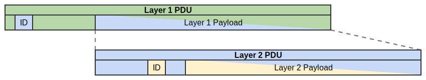

.. _packet-analysis:

===============
Packet Analysis
===============

.. TODO: integrate BoZ revisions

.. rst-class:: opening

  The Packet Analysis plugin architecture handles parsing of packet headers at
  layers below Zeek's existing Session analysis. In particular, this allows to
  add new link and network layer protocols to Zeek.
  This document provides an overview of the underlying architecture as well as
  an example-based walk-through. For further details, consider to take a look
  at the built-in packet analyzers as well as the packet analyzer tests.

The Flow of Packets
===================

The basic packet flow through Zeek is as follows.  First, an ``IOSource`` deals with
getting the packets into Zeek. While an ``IOSource`` can be used to interface all
sorts of capturing mechanisms, the default source makes use of libpcap to either
read PCAP files or sniff an interface. Once acquired, a packet is handed into
the packet analysis and processed layer by layer.

    Nesting of Protocol Data Units (PDUs).

At the lower layers, Protocol Data Units (PDUs) typically consist of a header
and a payload, where the payload is the next layer's PDU and the header carries
a numeric identifier that determines the encapsulated protocol (see figure
above, where "ID" denotes the location of such a numeric protocol identifier
within the header).

Each packet analyzer parses the packet's header according to the implemented
protocol, determines a suitable analyzer for the encapsulated protocol and hands its
payload to that next analyzer. Once the IP layer is reached, packet analysis is
finished and Zeek continues by constructing a session for the observed
connection. After session analysis, which includes processing of TCP and UDP,
the packet continues its journey into the land of application layer analyzers.
There, Dynamic Protocol Detection is used to determine the application layer
protocol and continue the analysis.

Packet Analyzer Configuration
=============================

The following script shows an example configuration of the Ethernet packet
analyzer:

.. literalinclude:: packet-analysis-1-ethernet.zeek
   :caption:
   :language: zeek
   :linenos:
   :tab-width: 4

Within :zeek:see:`zeek_init`, various EtherType-to-PacketAnalyzer mappings are
registered by using :zeek:see:`PacketAnalyzer::register_packet_analyzer`.  For
example, for EtherType ``0x8864``, the packet's payload is passed to the PPPoE
analyzer.

The ``default_analyzer`` analyzer specifies which packet analyzer to use if
none of the mappings matched. In case of Ethernet, we try to fall back to IP.

Furthermore, Ethernet needs to handle different types of frames, with three of
them identified using the first payload bytes (see `Wikipedia
<https://en.wikipedia.org/wiki/Ethernet_frame#Types>`_).
As the EtherType needs to be interpreted with respect to the frame type in these
cases, the Ethernet analyzer provides three additional configuration parameters,
``snap_analyzer``, ``novell_raw_analyzer``, and ``llc_analyzer``.
to configure analyzers that handle the different frame types.

.. note::

  There are a few conventions involved here:

  * The name of the module is expected to be ``PacketAnalyzer::<analyzer's canonical name>``.
  * The default analyzer is expected to be named ``default_analyzer``.

Packet analysis starts at a root analyzer that dispatches based on the link
types obtained from the ``IOSource``. Accordingly
:doc:`/scripts/base/packet-protocols/root/main.zeek` contains the following
call to integrate the Ethernet analyzer:

.. code-block:: zeek

  PacketAnalyzer::register_packet_analyzer(PacketAnalyzer::ANALYZER_ROOT, DLT_EN10MB, PacketAnalyzer::ANALYZER_ETHERNET);

Packet Analyzer API
===================

Just like for other parts of Zeek, a plugin may provide a packet analyzer by
adding a packet analysis component that instantiates an analyzer. The packet
analyzer itself is implemented by inheriting from
``zeek::packet_analysis::Analyzer`` and overriding the ``AnalyzePacket()``
method. The following is an excerpt from a test case that shows the exemplary
analysis of LLC:

.. literalinclude:: packet-analysis-2-llc.cc
   :caption:
   :language: C++
   :linenos:
   :tab-width: 4

First, we verify that the size of the packet matches what we expect. If that is
not the case, we create a weird using the ``Packet`` object that is passed along
the chain of analyzers. To signal that the analysis failed, the method returns
``false``. For valid packets, we just read some protocol-specific values. As of
now, there is no mechanism to pass extracted meta data on to other analyzers.
While it is possible to trigger events that receive these values as parameters,
keep in mind that handling events for every packet can be *extremely
expensive*. However, for our test case we defined an event as follows in a
separate ``.bif`` file:

.. code-block:: zeek

  event llc_demo_message%(dsap: count, ssap: count, control: count%);

Before we can expect the event to be generated, we need to integrate the
analyzer. The configuration might be included in the scripts that are shipped
with the packet analyzer. For example, one could add a new EtherType by
adding a call to :zeek:see:`PacketAnalyzer::register_packet_analyzer` from
within a :zeek:see:`zeek_init` event handler.
For the LLC example we redefine one of the additional constants:

.. code-block:: zeek

  redef PacketAnalyzer::ETHERNET::llc_analyzer = PacketAnalyzer::ANALYZER_LLC_DEMO;

In this example, packet analysis as well as all further analysis ends with the
LLC analyzer. The ``ForwardPacket()`` method can be used to pass data to another
packet analyzer. The method takes a pointer to the beginning of the data to
process (usually the start of the payload in the current context), the length of
the data to process, a pointer to the ``Packet`` object and an identifier. The
identifier would be used to lookup the next analyzer based on which other
analyzers were previously associated with LLC as a parent analyzer in a call to
:zeek:see:`PacketAnalyzer::register_packet_analyzer`.  If there is no
previously-registered analyzer that matches the identifier, it will fall back
to the ``default_analyzer`` if available.

In case a packet analyzer requires initialization, e.g., reading additional
configuration values from script-land, this can be implemented by overriding
the ``Initialize()`` method. When overriding this method, always make sure to
call the base-class version to ensure proper initialization.

With the addition of the transport-layer analyzer to the packet analysis framework,
it's now possible to register for ports as the identifier. This is natural, given
that a port number is just another numeric identifier for moving from one
protocol to another. Packet analyzers should call
``PacketAnalyzer::register_for_port`` or ``PacketAnalyzer::register_for_ports``
to ensure that the ports are also stored in the global ``Analyzer::ports`` table for
use with BPF filters.

The packet analysis framework also provides a ``register_protocol_detection``
method that is used to register a packet analyzer to use protocol detection
instead of using a numeric identifier. Analyzers can use this method and then
override ``Analyzer::DetectProtocol`` to search the packet data for byte strings
or other markers to detect whether a protocol exists in the data. This is similar
to how DPD works for non-packet analyzers, but is not limited to pattern matching.

.. note::

  When writing your own packet analyzer, take a look into the existing code to
  identify idiomatic ways to handle tasks like looking up configuration values.
