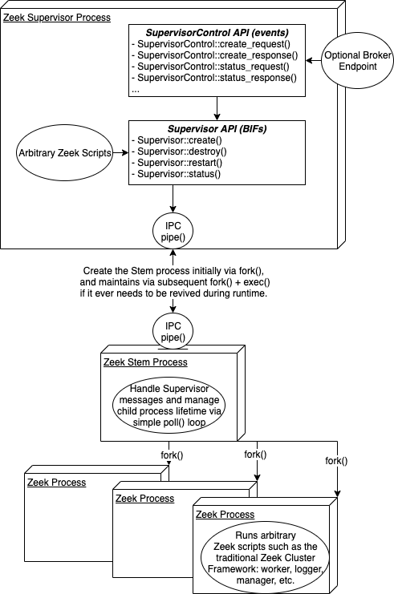

.. _framework-supervisor:

====================
Supervisor Framework
====================

.. rst-class:: opening

    The Supervisor framework enables an entirely new mode for Zeek, one that
    supervises a set of Zeek processes that are meant to be persistent.  A
    Supervisor automatically revives any process that dies or exits prematurely
    and also arranges for an ordered shutdown of the entire process tree upon
    its own termination.  This Supervisor mode for Zeek provides the basic
    foundation for process configuration/management that could be used to
    deploy a Zeek cluster similar to what ZeekControl does, but is also simpler
    to integrate as a standard system service.

Simple Example
==============

A simple example of using the Supervisor to monitor one Zeek process
sniffing packets from an interface looks like the following:

.. code-block:: console

  $ zeek -j simple-supervisor.zeek

.. literalinclude:: supervisor/simple-supervisor.zeek
   :caption: simple-supervisor.zeek
   :language: zeek
   :linenos:
   :tab-width: 4

The command-line argument of ``-j`` toggles Zeek to run in "Supervisor mode" to
allow for creation and management of child processes.  If you're going to test
this locally, be sure to change ``en0`` to a real interface name you can sniff.

Notice that the ``simple-supervisor.zeek`` script is loaded and executed by
both the main Supervisor process and also the child Zeek process that it spawns
via :zeek:see:`Supervisor::create` with :zeek:see:`Supervisor::is_supervisor`
or :zeek:see:`Supervisor::is_supervised` being able to distinguish the
Supervisor process from the supervised child process, respectively.
You can also distinguish between multiple supervised child processes by
inspecting the contents of :zeek:see:`Supervisor::node` (e.g. comparing node
names).

If you happened to be running this locally on an interface with checksum
offloading and want Zeek to ignore checksums, instead simply run with the
``-C`` command-line argument like:

.. code-block:: console

  $ zeek -j -C simple-supervisor.zeek

Most command-line arguments to Zeek are automatically inherited by any
supervised child processes that get created.  The notable ones that are *not*
inherited are the options to read pcap files and live interfaces, ``-r`` and
``-i``, respectively.

For node-specific configuration options, see :zeek:see:`Supervisor::NodeConfig`
which gets passed as argument to :zeek:see:`Supervisor::create`.

Supervised Cluster Example
==========================

To run a full Zeek cluster similar to what you may already know, try the
following script:

.. code-block:: console

  $ zeek -j cluster-supervisor.zeek

.. literalinclude:: supervisor/cluster-supervisor.zeek
   :caption: cluster-supervisor.zeek
   :language: zeek
   :linenos:
   :tab-width: 4

This script now spawns four nodes: a cluster manager, logger, worker, and
proxy.  It also configures each node to use a separate working directory
corresponding to the node's name within the current working directory of the
Supervisor process.  Any stdout/stderr output of the nodes is automatically
redirected through the Supervisor process and prefixes with relevant
information, like the node name that the output came from.

The Supervisor process also listens on a port of its own for further
instructions from other external/remote processes via
:zeek:see:`Broker::listen`.  For example, you could use this other script to
tell the Supervisor to restart all processes, perhaps to re-load Zeek scripts
you've changed in the meantime:

.. code-block:: console

  $ zeek supervisor-control.zeek

.. literalinclude:: supervisor/supervisor-control.zeek
   :caption: supervisor-control.zeek
   :language: zeek
   :linenos:
   :tab-width: 4

Any Supervisor instruction you can perform via an API call in a local script
can also be triggered via an associated external event.

For further details, consult the ``Supervisor`` API at
:doc:`/scripts/base/frameworks/supervisor/api.zeek` and
``SupervisorControl`` API (for remote management) at
:doc:`/scripts/base/frameworks/supervisor/control.zeek`.

Internal Architecture
=====================

The following details aren't necessarily important for most users, but instead
aim to give developers a high-level overview of how the process supervision
framework is implemented.  The process tree in "supervisor" mode looks like:

The top-level "Supervisor" process does not directly manage any of the
supervised nodes that are created.  Instead, it spawns in intermediate process,
called "Stem", to manage the lifetime of supervised nodes.  This is done for
two reasons:

1. Avoids the need to ``exec()`` the supervised processes which requires
   executing whatever version of the ``zeek`` binary happens to exist on
   the filesystem at the time of call and it may have changed in the meantime.
   This can help avoid potential incompatibility or race-condition pitfalls
   associated with system maintenance/upgrades.  The one situation that does
   still require an ``exec()`` is if the Stem process dies prematurely, but
   that is expected to be a rare scenario.
2. Zeek run-time operation generally taints global state, so creating an early
   ``fork()`` for use as the Stem process provides a pure baseline image to use
   for supervised processes.

Ultimately, there are two tiers of process supervision happening: the
Supervisor will revive the Stem process if needed and the Stem process will
revive any of its children when needed.

Also, either the Stem or any of its supervised children processes will
automatically detect if they are orphaned from their parent process and
self-terminate.  The Stem checks for orphaning simply by waking up every second
from its ``poll()`` loop to look if its parent PID changed.  A supervised node
checks for orphaning similarly, but instead does so from a recurring ``Timer``.
Other than the orphaning-check and how it establishes the desired
configuration from a combination of inheriting command-line arguments and
inspecting Supervisor-specific options, a supervised node does not operate
differently at run-time from a traditional Zeek process.

Node Revival
============

The Supervisor framework assumes that supervised nodes run until something asks
the Supervisor to stop them. When a supervised node exits unexpectedly, the Stem
attempts to revive it during its periodic polling routine. This revival
procedure implements exponential delay, as follows: starting from a delay of one
second, the Stem revives the node up to 3 times. At that point, it doubles the
revival delay, and again tries up to 3 times. This continues indefinitely: the
Stem never gives up on a node, while the revival delay keeps growing. Once a
supervised node has remained up for at least 30 seconds, the revival state
clears and will start from scratch as just described, should the node exit
again. The Supervisor codebase currently hard-wires these thresholds and delays.
