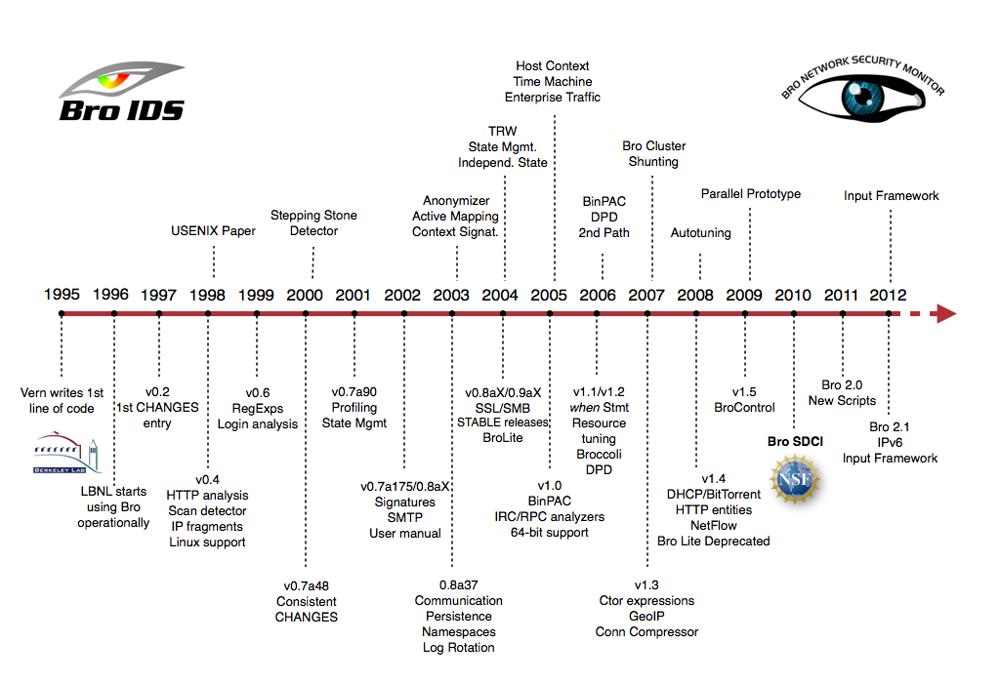
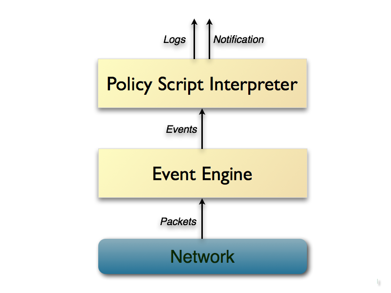

============
Introduction
============

.. contents::

Overview
--------

Bro is a passive, open-source network traffic analyzer. It is
primarily a security monitor that inspects all traffic on a link in
depth for signs of suspicious activity. More generally, however,
Bro supports a wide range of traffic analysis tasks even outside of
the security domain, including performance measurements and helping
with trouble-shooting.

The most immediate benefit that a site gains from deploying Bro is an
extensive set of *log files* that record a network's activity in
high-level terms. These logs include not only a comprehensive record
of every connection seen on the wire, but also application-layer
transcripts such as, e.g., all HTTP sessions with their requested
URIs, key headers, MIME types, and server responses; DNS requests with
replies; SSL certificates; key content of SMTP sessions; and much
more. By default, Bro writes all this information into well-structured
tab-separated log files suitable for post-processing with external
software. Users can however also chose from a set of alternative
output formats and backends to interface directly with, e.g., external
databases.

In addition to the logs, Bro comes with built-in functionality for a
range of analysis and detection tasks, including extracting files from
HTTP sessions, detecting malware by interfacing to external
registries, reporting vulnerable versions of software seen on the
network, identifying popular web applications, detecting SSH
brute-forcing, validating SSL certificate chains, and much more.

However, the key to understanding Bro lies in realizing that even
though the system comes with such powerful functionality out of the
box, fundamentally it represents a *platform* for traffic analyses
that's fully customizable and extensible: Bro provides users with a
domain-specific, Turing-complete *scripting language* for expressing
arbitrary analysis tasks. Conceptually, you can think of Bro as a
"domain-specific Python" (or Perl): just like Python, the system comes
with a large set of pre-built functionality (the "standard library"),
yet you are not limited to what the system ships with but can put Bro
to use in novel ways by writing your own code. Indeed, all of Bro's
default analyses, including all the logging, is the result of such
scripts; there's no specific analysis hard-coded into the core of
system.

Bro runs on commodity hardware and hence provides a low-cost
alternative to expensive proprietary solutions. Despite the price tag,
however, Bro actually goes far beyond the capabilities of other
network monitoring tools, which typically remain limited to a small
set of hard-coded analysis tasks. We emphasize in particular that Bro
is *not* a classic signature-based intrusion detection system (IDS).
While it supports such standard functionality as well, Bro's scripting
language indeed facilitates a much broader spectrum of very different
approaches to finding malicious activity, including semantic misuse
detection, anomaly detection, and behavioral analysis.

A large variety of sites deploy Bro operationally for protecting their
cyberinfrastructure, including many universities, research labs,
supercomputing centers, open-science communities, and major
corporations. Bro specifically targets high-speed, high-volume network
monitoring, and an increasing number of sites are now using the system
to monitor their 10GE networks, with some already moving on to 100GE
links. Bro accommodates such high-performance settings by supporting
scalable load-balancing: large sites typically run "Bro Clusters" in
which a high-speed frontend load-balancer distributes the traffic
across an appropriate number of backend PCs, all running dedicated Bro
instances on their individual traffic slices. A central manager system
coordinates the process, synchronizing state across the backends and
providing the operators with a central management interface for
configuration and access to aggregated logs. Bro's integrated
management framework, BroControl, supports such cluster setups
out-of-the-box.

Features
--------

Bro supports a wide range of analyses through its scripting language.
Yet even without further customization it comes with a powerful set of
features.

- Deployment

    * Runs on commodity hardware on standard UNIX-style systems
      (including Linux, FreeBSD, and MacOS).

    * Fully passive traffic analysis off a network tap or monitoring
      port.

    * Standard libpcap interface for capturing packets.

    * Real-time and offline analysis.

    * Cluster-support for large-scale deployments.

    * Unified management framework for operating both standalone and
      cluster setups.

    * Open-source under a BSD license.

- Analysis

    * Comprehensive logging of activity for offline analysis and
      forensics.

    * Port-independent analysis of application-layer protocols.

    * Support for many application-layer protocols (including DNS,
      FTP, HTTP, IRC, SMTP, SSH, SSL).

    * Analysis of file content exchanged over application-layer
      protocols, including MD5/SHA1 computation for fingerprinting.

    * Comprehensive IPv6 support.

    * Tunnel detection and analysis (including Ayiya, Teredo, GTPv1).
      Bro decapsulates the tunnels and then proceeds to analyze their
      content as if no tunnel was in place.

    * Extensive sanity checks during protocol analysis.

    * Support for IDS-style pattern matching.

- Scripting Language

    * Turing-complete language for expression arbitrary analysis
      tasks.

    * Event-based programming model.

    * Domain-specific data types such as IP addresses (transparently
      handling both IPv4 and IPv6), port numbers, and timers.

    * Extensive support for tracking and managing network state over
      time.

- Interfacing

    * Default output to well-structured ASCII logs.

    * Alternative backends for ElasticSearch and DataSeries. Further
      database interfaces in preparation.

    * Real-time integration of external input into analyses. Live
      database input in preparation.

    * External C library for exchanging Bro events with external
      programs. Comes with Perl, Python, and Ruby bindings.

    * Ability to trigger arbitrary external processes from within
      the scripting language.

History
-------

    Timeline of Bro's History (click to enlarge).

Bro's history goes back much further than many people realize. `Vern
Paxson <http://www.icir.org/vern>`_ designed and implemented the
initial version almost two decades ago.
Vern began work on the code in 1995 as a researcher at the `Lawrence
Berkeley National Laboratory (LBNL) <http://www.lbl.gov>`_. Berkeley
Lab began operational deployment in 1996, and the USENIX Security
Symposium published the original Bro paper in 1998 (later refined in a
subsequent `journal publication <http://www.icir.org/vern/papers/bro-CN99.pdf>`_).
In 2003, the
`National Science Foundation (NSF) <http://www.nsf.gov>`_ began
supporting research and advanced development on Bro at the
`International Computer Science Institute (ICSI)
<http://www.icsi.berkeley.edu>`_, where Vern now leads the `Networking
and Security group <http://www.icir.org>`_. Over the years, a growing
team of ICSI researchers and students kept adding novel functionality
to Bro, while LBNL continued its support with funding from the
`Department of Energy (DOE) <http://www.doe.gov>`_.

Much of Bro's capabilities originate in academic research projects,
with results often published at top-tier conferences. However, the key
to Bro's success was its ability to bridge the traditional gap between
academia and operations from early on, which provided the research
with crucial grounding to ensure that developed approaches stand up to
the challenges of the real world. Yet, with Bro's operational user
community growing over time, the research-centric development model
eventually became a bottleneck to the system's evolution: research
grants do not tend to support the more mundane parts of software
development and maintenance, even though those prove crucial for the
end-user experience. While Bro's capabilities always went beyond those
of traditional systems, a successful deployment used to require
significant technical expertise, typically with a large upfront
investment in tackling Bro's steep learning curve.  In 2010, NSF set
out to address this gap by awarding ICSI a grant dedicated solely to
Bro development out of its SDCI program.
With that support in place, the `National Center for
Supercomputing Applications (NCSA) <http://www.ncsa.illinois.edu>`_
joined the team as a core partner, and the Bro Project began to
completely overhaul many of the user-visible parts of the system for
the 2.0 release. Since that version came out, Bro has experienced an
tremendous growth in new deployments across a diverse range of
settings, and the Bro team is now working to build on this success by
further advancing the system's capabilities to address the challenges
of future networks.

Architecture
------------

    Bro's internal architecture.

Architecturally, Bro is layered into two major components. Its *event
engine* (or *core*) reduces the incoming packet stream into a series
of higher-level *events*. These events reflect network activity in
policy-neutral terms, i.e., they describe *what* has been seen, but
not *why*, or whether it is significant. For example, every HTTP
request on the wire turns into a corresponding ``http_request`` event
that carries with it the involved IP addresses and ports, the URI
being requested, and the HTTP version in use. The event however does
not convey any further *interpretation*, e.g., of whether that URI
corresponds to a known malware site.

Such semantics are instead derived by Bro's second main component, the
*script interpreter*, which executes a set of *event handlers* written
in Bro's custom scripting language. These scripts can express a site's
security policy, i.e., what actions to take when the monitor detects
different types of activity. More generally they can derive any
desired properties and statistics from the input traffic. Bro's
language comes with extensive domain-specific types and support
functionality; and, crucially, allows scripts to maintain state
over time, enabling them to track and correlate the evolution of what
they observe across connection and host boundaries. Bro scripts can
generate real-time alerts and also execute arbitrary external programs
on demand, e.g., to trigger an active response to an attack.
